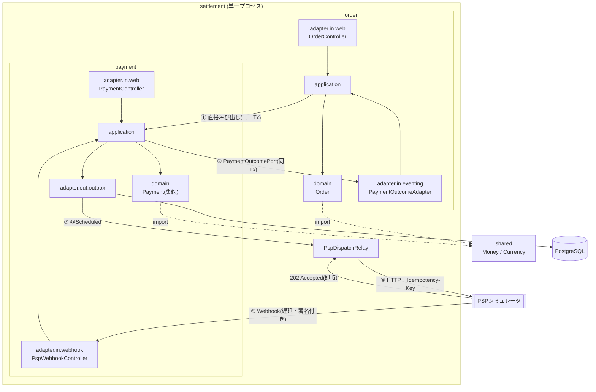

# settlement

注文から決済までを扱う演習用アプリケーション。**外部決済代行(PSP)との非同期なやり取りを、二重決済を起こさずに捌く**ことを主題にしている。

Java 21 / Spring Boot 4.1 / PostgreSQL 17 / Spring Data JDBC。

```
POST /orders → 与信 → 売上確定 → SETTLED
```

この1行の裏で、プロセスは4回スレッドをまたぎ、2回HTTPの境界を越え、外部からの通知を2回受け取る。途中でプロセスが落ちても、通知が重複しても、順序が入れ替わっても、金額が二重に動かないことをテストで示している。

---

## 主題

決済は「失敗してはいけないが、外部システムは必ず失敗する」領域にある。この演習が扱うのはそこだけに絞っている。

| 扱う | 扱わない |
| --- | --- |
| 送信の信頼性、冪等性、障害からの回復 | 画面、認証、商品管理 |
| 非同期な処理を追跡可能にすること | 複数通貨、為替、税計算 |
| 境界づけられたコンテキストの分離 | 実在のPSPとの接続(シミュレータで代替) |

外部PSPは `pspsimulator` パッケージのスタブで代替している。実プロダクトなら別サービスにあたるもので、本番コードからは参照していない(ArchUnitで強制)。

---

## 見どころ

### 1. 二重決済を起こさない送信経路

PSPへの送信は、DBの更新と同じトランザクションに入れられない。HTTPの応答を待つ数秒間ずっと行ロックを保持することになるうえ、送信後に落ちれば「送ったが記録していない」状態が残る。

Transactional Outbox で分離している。

```
① 確保      トランザクション1   status='SENDING', attempts+1
② 送信      トランザクション外   PSPへHTTP
③ 結果記録  トランザクション2   status='SENT' / 'PENDING'(再送予約) / 'FAILED'
```

- **`FOR UPDATE SKIP LOCKED`** で複数インスタンスが互いを待たずに重複しない集合を処理する
- **②の直前でプロセスが落ちた行**は `claimed_at` が一定時間を過ぎると回収対象になる。回収時は WARN を残す
- **`attempts` は送信失敗時ではなく確保時に加算**する。送信前に落ちてもカウントが進み、無限に再試行されない
- 結果を記録する更新はすべて `status='SENDING'` を条件に含める。回収し直された行を上書きしない

冪等性は両方向に効かせている。送信側は `Idempotency-Key`(= Outboxの行ID)、受信側は `eventId` を `ON CONFLICT (event_id) DO NOTHING` で弾く。アプリ側で存在確認してから挿入する形にはしない。確認と挿入の間に同じ通知が届けば擦り抜けるため。

→ [design.md §5.1](./docs/design.md)

### 2. 1注文が1本のトレースになる

非同期に分割された処理は、繋がっていなければ追えない。この経路には**トレースが切れる箇所が4つ**ある。

| 境界 | 越え方 |
| --- | --- |
| ① Outbox → Relay | `traceparent` を行に永続化し、拾った側で復元 |
| ② Relay → PSP | HTTPヘッダ(自動) |
| ③ PSP受付 → 遅延送信 | `ContextSnapshot` を `Runnable` に被せる |
| ④ Webhook → 受信側 | HTTPヘッダ(自動) |

伝搬形式は独自IDではなく **W3C Trace Context** を採用した。この設計は随所で「将来のサービス分割」を根拠にしており、伝搬形式だけ独自にするのは一貫しないため。

ログは ECS 形式の構造化JSONで、業務IDをメッセージ本文に埋め込まずフィールドとして出す。**何をログに出すかの基準**も明文化してある。

```json
{"message":"売上が確定したため注文を完了した",
 "traceId":"274e8d0a...","orderId":"3f2a...","paymentId":"78c1...",
 "orderStatus":"SETTLED"}
```

→ [design.md §8](./docs/design.md)

<!-- ここに Jaeger のスクリーンショットを置くと伝わりやすくなります。
     docker compose up -d して POST /orders した後、http://localhost:16686 のトレース画面。
     例:  -->

### 3. 依存の向きを機械で守る

`order` と `payment` は境界づけられたコンテキストとして分離している。`payment → order` の依存を作らないため、`payment` 側が自分で定義した `PaymentOutcomePort` を `order` 側が実装する(依存性逆転)。

口頭の約束では守られないので、**ArchUnitの7ルール**にしてCIで落とす。

- `payment` は `order` に依存しない
- `domain` は外側の層に依存しない / フレームワークに依存しない
- `PaymentOutcomePort` を実装してよいのは `order` だけ
- 本番コードは演習用の `pspsimulator` に依存しない

→ [design.md §7](./docs/design.md)

### 4. 踏んだ落とし穴を残してある

動いた記録ではなく、**調査の記録**を残している。いずれもコンパイルも起動も通るため、計測しないと気付けなかったもの。

- Spring Boot 4 は自動設定がモジュールごとに分割されており、ブリッジだけ入れてもMDCが空のまま
- `RestClient.builder()` を自前で呼ぶと観測機能が入らず、HTTP境界でトレースが切れる
- `@Scheduled(fixedDelay)` は**初回をコンテキスト起動直後に実行する**。間隔を1時間にしてもその1回は走り、テストと競合する
- 開発用アプリを起動したままテストを流すと、アプリ側のRelayがテストのOutbox行を横取りする。フレークに見えるが再現性がある

→ [design.md §8.7](./docs/design.md), [§9.1](./docs/design.md)

---

## アーキテクチャ



①②は自社ドメイン内なのでローカルトランザクション。**③④⑤だけが本物の非同期・分散処理**になる。この線引きが設計の核にあたる。

ヘキサゴナルアーキテクチャで、各コンテキストを `domain` / `application` / `adapter` の3層に分ける。`adapter` は駆動する側(`in`)と依頼される側(`out`)に分ける。

---

## 決済の流れ

```
POST /orders
  └─ Order を PENDING で保存 ─┐ 同一トランザクション
     Payment を AUTHORIZING で保存、Outbox に AUTHORIZE を積む ─┘

  (@Scheduled 1秒ごと)
  Relay が行を確保 → PSPへ与信を依頼 → 202
  1〜5秒後、PSPが署名付き Webhook を送る
     └─ 署名検証 → eventId で重複排除 → Payment を AUTHORIZED へ
        └─ 同一トランザクションで売上確定を開始、Outbox に CAPTURE を積む
           └─ Order を CONFIRMED へ

  (2周目)
  Relay → PSP → Webhook → Payment CAPTURED → Order SETTLED
```

`POST /orders` から先は人手を介さない。返金は `POST /orders/{id}/refunds` が起点で、同じ経路を3周目として通る。

分岐は金額の下2桁で決まる(再現性のため乱数にしていない)。

| 金額 | 結果 |
| --- | --- |
| 下2桁 99 | 与信拒否 → `CANCELLED` |
| 下2桁 98 | 売上確定失敗 → `SETTLEMENT_FAILED` |
| 下2桁 97 | 返金失敗 |
| それ以外 | `SETTLED` |

---

## 動かす

### devcontainer(推奨)

VS Code で「Reopen in Container」。`app` / `db` / `jaeger` がまとめて起動する。

```bash
./mvnw spring-boot:run

curl -X POST localhost:8080/orders \
  -H 'Content-Type: application/json' \
  -d '{"customerId":"11111111-1111-1111-1111-111111111111",
       "lines":[{"productId":"SKU-1","quantity":1,"amount":1000,"currency":"JPY"}]}'
```

返ってきた `orderId` で状態を追う。数秒後に `SETTLED` へ到達する。

```bash
curl localhost:8080/orders/{orderId}
```

トレースは `http://localhost:16686`(Jaeger)。サービス `settlement` を選ぶと、1注文が1本のトレースとして、4つの非同期境界を含んだ入れ子で表示される。

> コンテナ内に `docker` コマンドは無いので、`docker compose up` は使わない。compose の起動は devcontainer 自身が行う。

### ホスト側で動かす場合

```bash
docker compose up -d
OTLP_ENDPOINT=http://localhost:4318/v1/traces ./mvnw spring-boot:run
```

送出先のホスト名だけが変わる。既定値は compose のサービス名 `jaeger` を引く。

---

## API

| | |
| --- | --- |
| `POST /orders` | 注文を受け付け、同一トランザクションで与信を開始する。201 |
| `GET /orders/{orderId}` | 注文の現在状態と金額 |
| `POST /orders/{orderId}/refunds` | 返金を要求する。成立はWebhook到達後。202 |
| `GET /payments/{paymentId}` | 決済の状態、与信額・売上確定額・返金累計額 |
| `POST /payment/webhook` | PSPからの結果通知。HMAC-SHA256の署名を検証 |

金額はいずれも**確定した額**を返す。結果待ちや失敗のときに依頼額を見せると、押さえられていない額を押さえたように読めるため。

シミュレータ側(`/psp/**`)は実プロダクトには存在しないエンドポイント。

---

## テスト

```bash
./mvnw verify        # 204件 / 約40秒
```

- **実PostgreSQLを使う。** `FOR UPDATE SKIP LOCKED` と `ON CONFLICT DO NOTHING` に依存しており、H2で通ってもPostgreSQLで通る保証にならない
- **テスト用DBは開発用と分ける**(`settlement_test`)。開発中のアプリを起動したままでもテストが通る
- E2Eは `POST /orders` から `SETTLED` まで人手を介さず到達することを確認する。状態の確認はSQLではなく**照会APIを通す**
- CIは push と pull request で `mvnw -B verify`。PostgreSQLはサービスコンテナ

---

## ドキュメント

| | |
| --- | --- |
| [requirements.md](./docs/requirements.md) | 要件47件(EARS記法)、状態遷移、非機能要件の具体値 |
| [design.md](./docs/design.md) | **どう作るか**。アーキテクチャ、Outbox、可観測性、CI |
| [ubiquitous-language.md](./docs/ubiquitous-language.md) | 業務用語と、コンテキストごとの語彙の違い |
| [plan.md](./docs/plan.md) | 実装の順序と完了条件 |
| [adr/](./docs/adr/) | 設計判断の記録 |

読む順序に迷ったら **design.md §5.1(Outbox)と §8(可観測性)** が主題に最も近い。

---

## スコープ外

意図して外したもの。「やり残し」ではなく線引きとして記録している。

- **Void(与信取消)** — 売上確定との排他条件が主題を増やすだけで、分散処理の論点は追加されない([ADR-0001](./docs/adr/0001-exclude-void-from-scope.md))
- **デプロイ** — 本番環境が無いため、CIはテストの実行までで止まる
- **メトリクスとSLO** — Outboxの滞留件数やWebhookの応答時間は可観測性の自然な続きだが、未着手
- **OpenTelemetry Collector** — 本番運用しないため、tail sampling もPIIマスクもバックエンド切り替えも発生しない([design.md §8.4](./docs/design.md))
