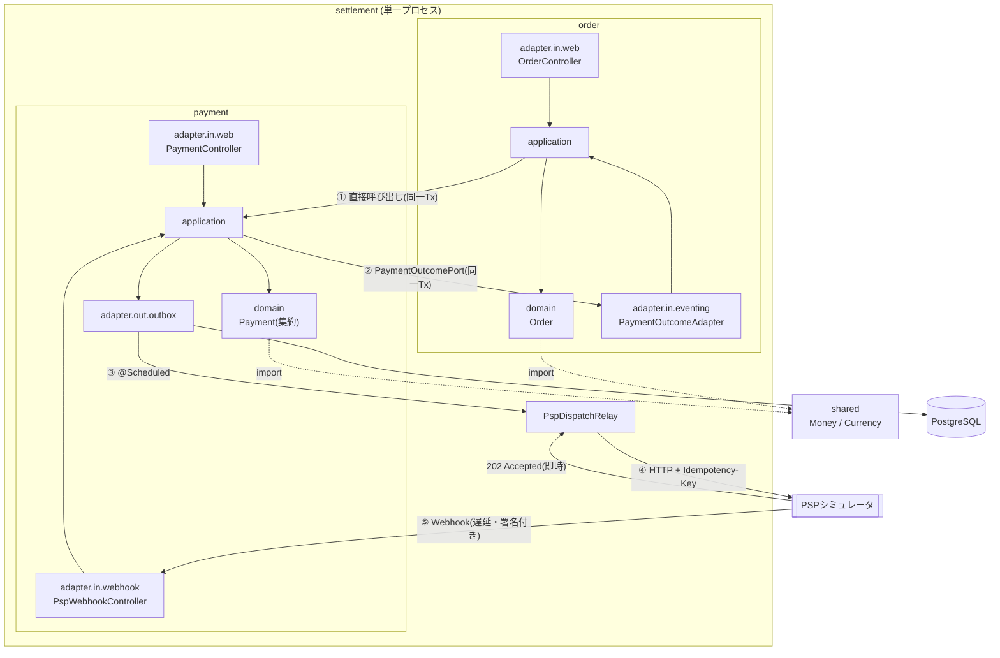
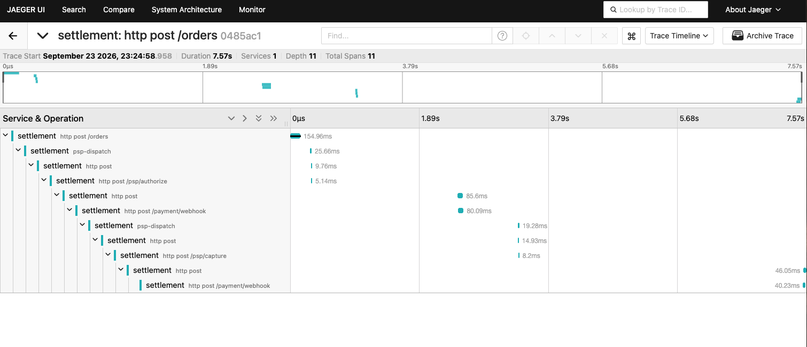

# settlement

注文から決済までを扱う演習用アプリケーション。**業務のモデリングと、分散システムの安全性を設計すること**ことを主題にしている。

Java 21 / Spring Boot 4.1 / PostgreSQL 17 / Spring Data JDBC。

```
POST /orders → 与信 → 売上確定 → SETTLED
```

この1行の裏で、処理は**4回スレッドをまたぎ、2回HTTPの境界を越え、外部からの通知を2回受け取る**。

つまり「落ちる」「重複する」「順序が入れ替わる」が**例外ではなく前提**になる。いずれもこちらからは制御できない。そのうえで金額が二重に動かないこと、そして何が起きたか後から追えるトレーサビリティを、テストで示している。

---

## 主題

守るべきものは「失敗しないこと」ではない。**与信は拒否されるし、売上確定も失敗する。** それらは業務上の正常な結果で、この実装でも `CANCELLED` / `SETTLEMENT_FAILED` という状態として扱っている。

守るべきなのは、**制御できない失敗が起きたときに、金銭の状態が壊れないこと**である。

外部PSPの応答も、ネットワークも、システム基盤の障害も、こちらからは制御できない。**制御できるのは「それらが落ちたときに何が残るか」だけ**になる。だから設計の主題は、失敗を防ぐことではなく、失敗が起きた後の状態を決めておくことになる。

| 起きること（制御できない） | 保証すること（設計で決める） |
| --- | --- |
| 送信の途中でプロセスが落ちる | 送ったか分からない状態を**残さない** |
| 通知が重複する / 順序が入れ替わる | 金銭が**二重に動かない** |
| PSPが応答しない | 未処理のまま**放置されない**。上限まで再送し、超えたら人手に上げる |

| 扱う | 扱わない |
| --- | --- |
| 障害・重複・順序入れ替わりが起きた後の一貫性 | 画面、認証、商品管理 |
| 境界づけられたコンテキストの分離と、その維持 | 複数通貨、為替、税計算 |
| 設計どおりに動いていることの観測可能性 | 実在のPSPとの接続(シミュレータで代替) |
| | **Saga による補償**（[理由](#分けていたら-saga-が必要になっていた)） |

外部PSPは `pspsimulator` パッケージのスタブで代替している。実プロダクトなら別サービスにあたるもので、本番コードからは参照していない(ArchUnitで強制)。

**乱数を使わない。** シミュレータの成否は金額の下2桁で決まる。障害系のシナリオを毎回同じように再現できないと、安全性の検証にならないため。

---

## 見どころ

一貫しているのは**「業務のモデリングと、分散システムの安全性を設計すること」**という点になる。どちらも、動くものを作るだけなら要らない設計である。

| | |
| --- | --- |
| **1. 金銭が二重に動かない設計** | 単独で信頼できる仕組みは無いものとして、壊れ方に1つずつ名前を付けて層を重ねる |
| **2. 設計判断** | 境界をどこに引き、何を採らなかったか。**採らなかった理由と、自分の設計のコスト**も書く |

そのうえで、**設計どおりに動いていることを観測できる形**にしてある。

---

## 見どころ 1: 金銭が二重に動かない設計

外部PSPとのやり取りには**単独で信頼できる仕組みが1つも無い**。ネットワークは切れ、プロセスは落ち、通知は重複し、順序は入れ替わる。どれか1つの対策に依存すると、その1つが破れたときに金銭が二重に動く。

そこで**壊れ方を1つずつ名前を付けて、それぞれに対策を置く**形にした。

| 壊れ方 | 起きること | 対策 |
| --- | --- | --- |
| 送信中にプロセスが落ちる | 送ったか分からない行が残る | **Transactional Outbox**。DB更新と送信を分離し、送信は必ず行として残ってから行う |
| 落ちた行が放置される | 与信が永久に始まらない | **`claimed_at` による回収**。一定時間を過ぎた `SENDING` を再び走査対象に戻す |
| 回収した行を二重に送る | PSPに2回届く | **`Idempotency-Key`**(= Outboxの行ID)。PSP側が同じキーを弾く |
| 複数インスタンスが同じ行を掴む | 同じ依頼が並行して飛ぶ | **`FOR UPDATE SKIP LOCKED`**。互いを待たずに重複しない集合を取る |
| 回収後に元の処理が結果を書き戻す | 別インスタンスの作業を上書きする | 結果記録の更新すべてに **`status='SENDING'` を条件**に含める |
| 毎回落ちる行を無限に再試行する | 気付かないまま負荷を掛け続ける | **`attempts` を確保時に加算**し、上限で `FAILED`(終端)。**自動回復させず人手に上げる** |
| 同じ通知が2回届く | 状態を2回進めてしまう | **`ON CONFLICT (event_id) DO NOTHING`**。アプリ側で存在確認してから挿入する形にはしない。確認と挿入の間に届けば擦り抜ける |
| 通知の順序が入れ替わる | 古い結果で新しい状態を壊す | 集約が遷移を拒否し、**200を返して再送を止める**。異常ではないので WARN に理由を残す |
| 同じ集約を並行して更新する | 更新が失われる | **楽観ロック(`@Version`)** |
| 偽の通知が届く | 任意の決済を操作される | **HMAC-SHA256の署名検証**。比較は `MessageDigest.isEqual`(不一致位置で打ち切らない)、署名は5分の許容時間付きで**再送攻撃の窓を閉じる** |

### 不変条件は集約の中だけに置く

呼び出し側の検査に依存しない。**呼び出し側が忘れても自衛できる場所**に条件を置く(REQ-PAY-012)。

```java
// Payment#capture
if (amount.isGreaterThan(authorization.getAmount())) → 拒否   // REQ-PAY-005 与信額を超えられない
if (now.isAfter(authorization.getExpiresAt()))        → 拒否   // REQ-PAY-006 与信には期限がある
if (capture != null && capture.isPending())           → 拒否   // REQ-PAY-010 二重ディスパッチの防止

// Payment#requestRefund
売上確定が完了していなければ拒否                                // REQ-PAY-007 受け取っていない金銭は戻せない
確定済み + 処理中の返金累計が売上確定額を超えたら拒否            // REQ-PAY-008
```

返金累計は**確定済みのみ**と**確定済み+処理中**の2種類を使い分ける。超過判定には処理中も数えないと、結果待ちの間にもう一度返金を通せてしまう。

照会APIが返す金額も同じ思想で、依頼額ではなく**確定した額**を返す。結果待ちや失敗のときに依頼額を見せると、押さえられていない額を押さえたように読める。

→ [design.md §5.1](./docs/design.md)（Outbox）, [§3](./docs/design.md)（不変条件の置き場所）

---

## 見どころ 2: 設計判断

### 境界づけられたコンテキストを2つ置く

`order`(注文)と `payment`(決済)に分ける。**同じ言葉が別の意味を持つ**ことが、境界が実在する証拠になる。

| 用語 | `order` での意味 | `payment` での意味 |
| --- | --- | --- |
| 注文 | 商品明細・数量・金額を持つ完全なエンティティ | **`OrderId` という参照のみ**。明細も商品情報も持たない |

決済は「何を買ったか」を知る必要がない。金額と、結果を返す先が分かればよい。**`payment` が注文明細を参照し始めたら、それは境界が壊れたサイン**になる。

変更理由も異なる。`order` は商取引のルールで変わり、`payment` はPSPのプロトコルと決済のルールで変わる。別々に変わるものを1つの塊にすると、片方の都合でもう片方が壊れる。

### コンテキストの境界とサービス分割の境界は別の判断

この2つは混同されやすいが、**決める基準がまったく違う**。

| | 何で決めるか |
| --- | --- |
| **コンテキストの境界** | 業務の言語。モデルの意味が変わるところ（前節） |
| **サービス分割の境界** | 業務操作の凝集度と、運用上の要求（独立デプロイ・独立スケール・障害隔離） |

**コンテキストが2つあることは、プロセスを2つにする理由にならない。** 1プロセスの中に複数のコンテキストが同居するのは正常な形で、それがモジュラーモノリスにあたる。

#### サービスを分けなかった理由

**「注文を受け付けて与信を開始する」は、業務上1つの操作である。** 受け付けたが与信が始まっていない注文には、業務上の意味がない。

```java
// CreateOrderService（@Transactional）
Order savedOrder = orderRepository.save(order);         // 注文を保存
authorizePaymentUseCase.authorize(orderId, amount);      // 決済を開始し Outbox に積む
```

ここをサービスで分断すると、**業務的に不可分なものが技術の都合で可分になる**。「注文はあるが決済が無い」という、業務側の誰も定義していない状態が観測可能になり、その状態の意味と扱いを後から決める羽目になる。

運用上の要求も、現時点では発生していない。`order` と `payment` を別々にデプロイしたい理由も、別々にスケールさせたい負荷も、片方の障害をもう片方から隔離したい事情も無い。**利益が無いところに分断のコストだけを払うことになる。**

#### トランザクション特性は結果であって理由ではない

同一プロセスに置いた**結果として**、両者の更新は1つのローカルトランザクションに収まる。与信の開始に失敗すれば注文ごとロールバックし、中途半端な状態が原理的に生まれない。

```
order ←→ payment    同一プロセス・同一DB・同一トランザクション   ← 配置の結果
payment ←→ 外部PSP  ネットワーク越し・結果は数秒後にWebhookで届く ← 選べない
```

**この性質は「良いから選んだ」のではなく、配置から導かれたものである。** 順序を逆にして「1トランザクションに収めたいからここで区切る」と考えると、技術的都合が業務の境界を決めることになり、コンテキストの定義が歪む。

一方 PSP との境界は**選択の余地がない**。相手は別組織の別システムで、同一プロセスに置きようがない。ここだけが本物の分散処理で、Outbox・冪等性・回収といった仕組みが要る([見どころ1](#見どころ-1-金銭が二重に動かない設計))。**避けられない場所にだけコストを払う**という線引きになっている。

### 分けていたら Saga が必要になっていた

前節の判断を、払わずに済んだコストの側から見ておく。

`order` と `payment` を別サービスにすれば、いま1つのトランザクションで済んでいる箇所が**分散トランザクションに変わる**。ローカルトランザクションでは守れなくなるので、Saga のような補償の仕組みが必要になる。

| 追加で必要になるもの | |
| --- | --- |
| 補償トランザクション | 「与信を開始できなかったので注文を取り消す」を**自分で書く** |
| Saga 自体の状態管理 | どこまで進んだかを永続化し、途中で落ちても再開できるようにする |
| 補償の冪等性 | 補償自体が二重に走りうるため、そちらにも重複対策が要る |
| 中間状態の扱い | 「注文はあるが決済が無い」状態に、業務的な意味と運用手順を与える |

**これは複雑性であって、機能ではない。** しかも解決する問題は「サービスを分けたから生まれた問題」で、分けなければ存在しない。

> 本物の分散トランザクションは PSP との間にしか無い。**そこには既に Outbox で対処している。** 自社ドメイン内に2つ目を自分で作る理由がない。

### だからモジュラーモノリスにする

分割**しない**のではなく、**分割を先送りする**選択にあたる。先送りが成立するのは、境界が実際に守られている場合だけである。

モジュラーモノリスが失敗するのはいつも同じ理由による。**同じプロセスにいるので、境界を越えるのが簡単すぎる。** `payment` から `order` のクラスを `import` する、テーブルを直接 JOIN する。1回やれば次からは前例になり、数か月で境界は消える。

そこで依存の向きを設計で作り、**機械で検証する**。

`payment` は `order` を知らない。結果を伝えるための窓口 `PaymentOutcomePort` を **`payment` 側が自分で定義**し、それを `order` 側が実装する(依存性逆転)。呼び出しは普通のメソッド呼び出しなので、呼び出し元のトランザクションにそのまま乗る。

```
payment.application.port.out.PaymentOutcomePort   ← payment が定義する
        ▲ implements
order.adapter.in.eventing.PaymentOutcomeAdapter   ← order が実装する

依存の向き： order ──→ payment  （一方向のみ）
```

この約束を口頭で守るのは無理なので、**ArchUnitの7ルール**にしてCIで落とす。

| ルール | 守るもの |
| --- | --- |
| `payment` は `order` に依存しない | コンテキストの一方向性 |
| `PaymentOutcomePort` を実装してよいのは `order` だけ | 窓口を他所に塞がれない。複数実装は起動時にも失敗する |
| `shared` は `order` / `payment` のどちらにも依存しない | 共有物が特定コンテキストに引きずられない |
| `domain` 層は外側の層に依存しない | ヘキサゴナルの依存方向 |
| `application` 層は `adapter` 層に依存しない | 同上 |
| `domain` 層と `shared` はフレームワークに依存しない | 業務ルールがSpringに縛られない |
| 本番コードは演習用の `pspsimulator` に依存しない | スタブが本番経路に混ざらない |

**将来分割するときに払うコストは、この一方向性が保たれているかで決まる。** 契約は既に `PaymentOutcomePort` という形で明示されているので、分割はアダプタをリモート呼び出しに差し替える作業になる。そのとき初めて Saga が要るかを判断すればよく、**要ると分かってから導入する**。

→ [design.md §1](./docs/design.md)（設計方針）, [§7](./docs/design.md)（依存関係の自動検証）

### ポートとアダプタは、この規模では過剰な部分がある

自分の設計のコストも書いておく。ポートは全部で17本あり、**実装はすべて1つずつ**である。

| 分類 | 本数 | この規模で効いているか |
| --- | --- | --- |
| `PaymentOutcomePort` | 1 | **効いている。無いと成立しない** |
| コンテキストを跨ぐ in-port（`AuthorizePaymentUseCase` など） | 2 | 効いている |
| port.out（永続化・Outbox・Webhook記録） | 4 | 効いている |
| **コンテキスト内の in-port**（`FindOrderUseCase` など） | **10** | **効いていない** |

**10本は儀式になっている。** `FindOrderUseCase` は実装が `FindOrderService` 1つだけで、Controller が Service を直接呼んでも動作も可読性も変わらない。この部分だけを見れば、**レイヤードアーキテクチャで十分だった**。

一方で、残りの7本は外せない。

- **`PaymentOutcomePort` を消すと、`payment` が `order` を直接呼ぶことになる。** `order → payment`(与信の依頼)と `payment → order`(結果の反映)で**依存が循環する**。モジュラーモノリスの前提が崩れ、ArchUnitのルールも成立しなくなる
- **port.out を消すと、`application` が `adapter` を直接参照する。** 「`application` 層は `adapter` 層に依存しない」というルールごと消える

### ポートを置くかどうかの判断基準

「実装が増える見込みがあるか」で判断すると、この演習ではほぼ全滅する。増える見込みはどこにも無い。

**判断基準は「依存の向きを変える必要があるか」**だと考えている。ポートの本質は差し替えではなく**矢印の反転**で、`PaymentOutcomePort` はまさにそれを目的に置かれている。一方、Controller から Service への呼び出しは元から正しい向きなので、反転させる理由がない。

この基準で切れば、コンテキスト内の in-port は落とせる。

それでも残しているのは2つの理由による。

1. **一貫性。** コンテキストを跨ぐ呼び出しにポートが要る以上、一部だけ Controller が Service を直接呼ぶ形にすると、どちらが正なのかが読み手に伝わらない
2. **学習目的。** 構成を一通り通して書くことが演習の目的に含まれている

実務であれば、**1本目のポートを書く前にこの判断をする**。結果として置かない選択になることもある。

### モデルの詰め替えは、層ごとではなく意味が変わる場所で行う

厳密にやるなら、層を越えるたびに専用のモデルへ詰め替えることになる。Web DTO → アプリケーション層のコマンド → ドメイン、といった具合に。**そこまではしていない。**

ただし「詰め替えをしない」のではなく、**する場所としない場所を分けている**。

**詰め替えている場所**

| 境界 | 理由 |
| --- | --- |
| ドメイン ⇔ 永続化エンティティ | 形が違う。エンティティは `@Version` を持ち、集約が子エンティティを含む構造もテーブルに合わせて平たくなる |
| `order.OrderId` ⇔ `payment.OrderId` | **意味が違う**。`order` では集約のIDだが、`payment` では外部への単なる参照。同じ型にすると境界が溶ける |
| ドメイン → `OrderSummary` → Web レスポンス | 集約をそのまま外へ出さない。状態を変える操作が並んだオブジェクトを、読むだけの経路に渡さないため |

**詰め替えていない場所**

| 境界 | 判断 |
| --- | --- |
| Web リクエスト → アプリケーション層 | `CreateOrderRequest.toOrderLines()` が**ドメインの値オブジェクトを直接組み立てる**。間にコマンドオブジェクトを挟まない |
| `Money` の扱い | `shared.Money` を全コンテキスト・全層で共有する（25ファイルが参照） |

### 判断の根拠

**層を越えたから詰め替えるのではなく、意味が変わるから詰め替える。**

`Money` は「金額 + 通貨」であり、`order` でも `payment` でも永続化層でも**意味が1ミリも変わらない**。ここに層ごとの型を置くと、増えるのは変換コードだけで、表現力は何も増えない。`order` が `payment` を呼ぶ `authorize(OrderId, Money)` のような箇所では、呼ぶたびに変換が挟まることになる。

対して `OrderId` は、`order` では集約の同一性を表し、`payment` では外部システムへの参照でしかない。**意味が違うので型を分ける価値がある。**

`shared` は DDD でいう **Shared Kernel** にあたる。共有する以上、変更には両コンテキストの合意が要るという制約が付く。`Money` のように安定していて意味が変わらないものに限定していて、ArchUnit の「`shared` は `order` / `payment` のどちらにも依存しない」がその範囲を守っている。

### この判断のコスト

**入口の DTO がドメインの値オブジェクトを直接組み立てるため、APIの形とドメインの構造が直結する。** `OrderLine` の構造を変えれば `CreateOrderRequest` の変換も直す必要がある。コマンドオブジェクトを挟めば、その影響をアプリケーション層で吸収できた。

この規模では受け入れられる。`CreateOrderRequest` は1箇所、変換も数行にすぎない。**入口の種類が増えたとき**（別のクライアント向けAPI、バッチ取込など）に、同じドメイン構築が複数箇所へ散り始める。そこが切り替えの目安になる。

### 全体図



①②は自社ドメイン内なのでローカルトランザクション。**③④⑤だけが本物の非同期・分散処理**になる。この線引きが設計の核にあたる。

ヘキサゴナルアーキテクチャで、各コンテキストを `domain` / `application` / `adapter` の3層に分ける。`adapter` は駆動する側(`in`)と依頼される側(`out`)に分ける。

---

## 設計を観測可能にする

「動かしてから監視を足す」のではなく、**設計の段階でどこが切れるかを洗い出し、切れない形にした**。ここも設計判断として扱っている。

### どこが切れるかは構成が決める

同期的なモノリスなら1本のスタックトレースで足りる。この構成はそうではない。**境界の性質が違うので、越え方も違う。**

| 境界 | 性質 | 越え方 |
| --- | --- | --- |
| ① Outbox → Relay | **別プロセス・別時刻になりうる** | `traceparent` を**行に永続化**し、拾った側で子spanとして復元 |
| ② Relay → PSP | HTTP | ヘッダ(自動) |
| ③ 受付 → 遅延送信 | 同一プロセスの別スレッド・後の時刻 | `ContextSnapshot` を `Runnable` に被せる |
| ④ Webhook → 受信側 | HTTP | ヘッダ(自動) |

**①だけはスレッドローカルでは渡せない。** Relay は別のプロセスが、別の時刻に拾う。**永続化するしかない**というのが構成から導かれる帰結で、そのためにマイグレーションを1本足している(`V7__dispatch_traceparent.sql`)。

Relay は**1バッチではなく1行ごと**にトレースを出し入れする。バッチ単位にすると、無関係な10注文が1本のトレースに混ざる。

### ログに何を出すかも設計で決める

出力箇所を層で決めない。**その1行だけが答えられる問いがあるか**で決める。外部境界を越えた事実と業務上の判断は残し、メソッドの出入りや素のDB操作は残さない。後者はspanがより正確に答えるためである。

1行の構成は**スコープ**で分ける。

```java
log.atInfo()                                  // 本文は固定文字列。同じ事象を数えられる
   .addKeyValue("orderStatus", "SETTLED")     // その行だけの値
   .log("売上が確定したため注文を完了した");     // orderId / paymentId は MDC(処理全体に載る)
```

**`order` と `payment` の両方でログを出す。** 分割を前提にしている以上、片方にしかログが無い状態は同一プロセスで動くあいだだけ問題に見えないだけで、分割した瞬間に片方が無音のサービスになる。

### 設計どおりに繋がっていることの確認

`POST /orders` を1回投げた結果。**11個のspanが1本に繋がっている。**



見るべきは **`psp-dispatch` が `/orders` の子になっていること**である。Relay は別スレッド・後の時刻で動くので、スレッドローカルでは繋がらない。行に永続化した `traceparent` を復元して初めてこの親子関係になる。ここが切れていれば、Relay 以降は**別トレースの新しい root** として記録される。

時間軸の空白は遅延送信(境界③)で、全体 7.57秒のほとんどは待ち時間である。処理が重いのではなく、**非同期であることがそのまま見えている**。

→ [design.md §8](./docs/design.md)（伝搬形式の選定、ログ出力基準、送出先の構成）
---

## 不安定なテストの原因を突き止める

全体実行でだけ2件のテストが落ちた。単独実行では通る。

```
PspDispatchRelayTest.staleSendingRowIsReclaimed       expected: SENT  but was: SENDING
WebhookDispatcherTest.authorizedResultReachesTheReceiver  expected: 1  but was: 2
```

**フレーキーテスト**（コードを変えていないのに通ったり落ちたりするテスト）の典型的な症状で、最初はそう判断した。

しかし**4回連続で同じ箇所が落ちた**。確率的にばらつかない以上、再現性がある。原因は2つあった。

**1. 開発中のアプリがテストと同じDBを見ていた。** `./mvnw spring-boot:run` を起動したままにしていると、アプリ側の `PspDispatchRelay` が1秒ごとに `payment_psp_dispatch_events` を走査し、**テストが作った行を確保して実際にPSPへ送っていた**。テスト用DBを分離して解消した。

**2. `@Scheduled(fixedDelay)` は初回をコンテキスト起動直後に実行する。** 間隔を1時間にしてもその1回は必ず走り、テスト本体と競合する。コードのコメントは「起動時の1回は行を用意する前なので何も拾わない」と逆のことを主張していた。起動の契機を `PspDispatchScheduler` として Relay から切り離し、テストからは自動起動を止めて直接呼ぶ形にした。

どちらも**テストのコードを読んでも理由が分からない**種類の問題である。「落ちたら再実行」で済ませていれば、この2つは残ったままだった。

→ [design.md §9.1](./docs/design.md)（分離の方法）, [§8.7](./docs/design.md)（可観測性の実装で踏んだもの）

---

## 決済の流れ

```
POST /orders
  └─ Order を PENDING で保存 ─┐ 同一トランザクション
     Payment を AUTHORIZING で保存、Outbox に AUTHORIZE を積む ─┘

  (@Scheduled 1秒ごと)
  Relay が行を確保 → PSPへ与信を依頼 → 202
  1〜5秒後、PSPが署名付き Webhook を送る
     └─ 署名検証 → eventId で重複排除 → Payment を AUTHORIZED へ
        └─ 同一トランザクションで売上確定を開始、Outbox に CAPTURE を積む
           └─ Order を CONFIRMED へ

  (2周目)
  Relay → PSP → Webhook → Payment CAPTURED → Order SETTLED
```

`POST /orders` から先は人手を介さない。返金は `POST /orders/{id}/refunds` が起点で、同じ経路を3周目として通る。

分岐は金額の下2桁で決まる(再現性のため乱数にしていない)。

| 金額 | 結果 |
| --- | --- |
| 下2桁 99 | 与信拒否 → `CANCELLED` |
| 下2桁 98 | 売上確定失敗 → `SETTLEMENT_FAILED` |
| 下2桁 97 | 返金失敗 |
| それ以外 | `SETTLED` |

---

## 動かす

### devcontainer(推奨)

VS Code で「Reopen in Container」。`app` / `db` / `jaeger` がまとめて起動する。

```bash
./mvnw spring-boot:run

curl -X POST localhost:8080/orders \
  -H 'Content-Type: application/json' \
  -d '{"customerId":"11111111-1111-1111-1111-111111111111",
       "lines":[{"productId":"SKU-1","quantity":1,"amount":1000,"currency":"JPY"}]}'
```

返ってきた `orderId` で状態を追う。数秒後に `SETTLED` へ到達する。

```bash
curl localhost:8080/orders/{orderId}
```

トレースは `http://localhost:16686`(Jaeger)。サービス `settlement` を選ぶと、[上に載せた図](#設計どおりに繋がっていることの確認)と同じものが出る。1注文が1本のトレースとして、4つの非同期境界を含んだ入れ子で表示される。

> コンテナ内に `docker` コマンドは無いので、`docker compose up` は使わない。compose の起動は devcontainer 自身が行う。

### ホスト側で動かす場合

```bash
docker compose up -d
OTLP_ENDPOINT=http://localhost:4318/v1/traces ./mvnw spring-boot:run
```

送出先のホスト名だけが変わる。既定値は compose のサービス名 `jaeger` を引く。

---

## API

| | |
| --- | --- |
| `POST /orders` | 注文を受け付け、同一トランザクションで与信を開始する。201 |
| `GET /orders/{orderId}` | 注文の現在状態と金額 |
| `POST /orders/{orderId}/refunds` | 返金を要求する。成立はWebhook到達後。202 |
| `GET /payments/{paymentId}` | 決済の状態、与信額・売上確定額・返金累計額 |
| `POST /payment/webhook` | PSPからの結果通知。HMAC-SHA256の署名を検証 |

金額はいずれも**確定した額**を返す。結果待ちや失敗のときに依頼額を見せると、押さえられていない額を押さえたように読めるため。

シミュレータ側(`/psp/**`)は実プロダクトには存在しないエンドポイント。

---

## テスト

```bash
./mvnw verify        # 204件 / 約40秒
```

見どころ1で挙げた壊れ方には、**それぞれ対応するテストがある**。

| 壊れ方 | テスト |
| --- | --- |
| 落ちた行が放置される | `REQ-NFR-009: claimTimeout を過ぎた SENDING の行は回収する` |
| 無限に再試行する | `REQ-PSP-004: 試行上限を超えたディスパッチは FAILED になり以降拾われない` |
| 通知が重複する | `REQ-PSP-006: 同じ eventId の再送では状態が二重に進まない` |
| 順序が入れ替わる | `REQ-PSP-007: 適用できない通知は 200 を返し、WARN を残す` |
| 偽の通知が届く | `REQ-PSP-005: 署名が不正なら 401 を返し、いかなる状態変更も行わない` |
| 署名を再利用される | `REQ-PSP-005: 許容時間を過ぎた署名は再利用できず 401 になる` |
| 確保と送信が同一トランザクションになる | `REQ-PSP-001: 確保と送信は別トランザクションで行われる` |
| トレースが切れる | `REQ-NFR-008: 注文の受付から確定までが1本のトレースとして繋がる`(4つの境界それぞれにも継続性のテストがある) |
| 正常系にログが出ていない | `REQ-NFR-008: 正常系のログが1本のトレースに載り、業務IDがフィールドとして出る` |

- **実PostgreSQLを使う。** `FOR UPDATE SKIP LOCKED` と `ON CONFLICT (event_id) DO NOTHING` に依存しており、H2で通ってもPostgreSQLで通る保証にならない
- **テスト用DBは開発用と分ける**(`settlement_test`)。開発中のアプリを起動したままでもテストが通る
- E2Eは `POST /orders` から `SETTLED` まで人手を介さず到達することを確認する。状態の確認はSQLではなく**照会APIを通す**
- CIは push と pull request で `mvnw -B verify`。PostgreSQLはサービスコンテナ

---

## ドキュメント

| | |
| --- | --- |
| [requirements.md](./docs/requirements.md) | 要件47件(EARS記法)、状態遷移、非機能要件の具体値 |
| [design.md](./docs/design.md) | **どう作るか**。アーキテクチャ、Outbox、可観測性、CI |
| [ubiquitous-language.md](./docs/ubiquitous-language.md) | 業務用語と、コンテキストごとの語彙の違い |
| [plan.md](./docs/plan.md) | 実装の順序と完了条件 |
| [adr/](./docs/adr/) | 設計判断の記録 |

読む順序に迷ったら **design.md §5.1(Outbox)と §8(可観測性)** が主題に最も近い。

---

## スコープ外

**学習目的の成果物であり、本番運用は想定していない。** 外部PSPはシミュレータで代替しており、実在の決済サービスとの接続も、実運用に必要な監査・保全・鍵管理も含まない。

そのうえで、意図して外したものを記録しておく。「やり残し」ではなく線引きである。

- **Void(与信取消)** — 売上確定との排他条件が主題を増やすだけで、分散処理の論点は追加されない([ADR-0001](./docs/adr/0001-exclude-void-from-scope.md))
- **デプロイ** — 本番環境が無いため、CIはテストの実行までで止まる
- **メトリクスとSLO** — Outboxの滞留件数やWebhookの応答時間は可観測性の自然な続きだが、未着手
- **OpenTelemetry Collector** — 本番運用しないため、tail sampling もPIIマスクもバックエンド切り替えも発生しない([design.md §8.4](./docs/design.md))
