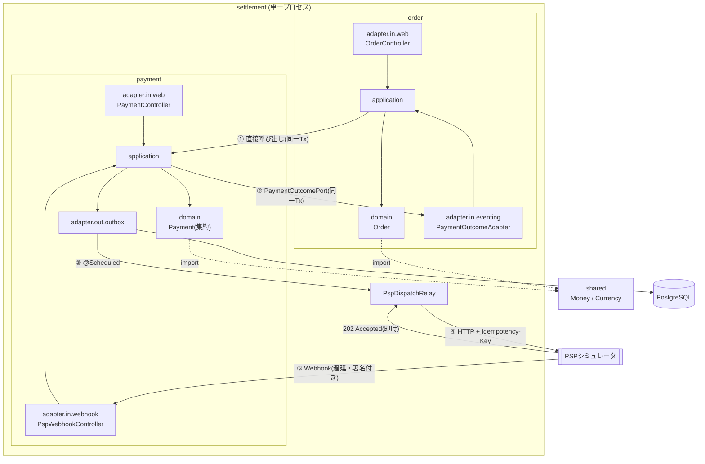

# settlement

注文から決済までを扱う演習用アプリケーション。**「壊れても金銭が二重に動かない」設計**と、**「非同期に分割された処理を1本で追える」トレーサビリティ**の2点に主題を絞っている。

Java 21 / Spring Boot 4.1 / PostgreSQL 17 / Spring Data JDBC。

```
POST /orders → 与信 → 売上確定 → SETTLED
```

この1行の裏で、処理は**4回スレッドをまたぎ、2回HTTPの境界を越え、外部からの通知を2回受け取る**。

つまり「落ちる」「重複する」「順序が入れ替わる」が**例外ではなく前提**になる。そのうえで金額が二重に動かないこと、そして何が起きたか後から追えることを、テストで示している。

---

## 主題

決済は **「失敗してはいけないが、外部システムは必ず失敗する」** 領域にある。ここは設計で守るしかない。

| 扱う | 扱わない |
| --- | --- |
| 障害・重複・順序入れ替わりに対する安全性 | 画面、認証、商品管理 |
| 非同期な構成のトレーサビリティ | 複数通貨、為替、税計算 |
| 境界づけられたコンテキストの分離 | 実在のPSPとの接続(シミュレータで代替) |

外部PSPは `pspsimulator` パッケージのスタブで代替している。実プロダクトなら別サービスにあたるもので、本番コードからは参照していない(ArchUnitで強制)。

**乱数を使わない。** シミュレータの成否は金額の下2桁で決まる。障害系のシナリオを毎回同じように再現できないと、安全性の検証にならないため。

---

## 見どころ

意図して踏み込んだのは次の2点。どちらも、動くものを作るだけなら要らない設計である。

| | |
| --- | --- |
| **1. 金銭が二重に動かない設計** | 単独で信頼できる仕組みは無いものとして、壊れ方に1つずつ名前を付けて層を重ねる |
| **2. アーキテクチャから導いたトレーサビリティ** | 「この構成だからここが切れる、だからこう残す」の順で設計する。ログの後付けではない |

---

## 見どころ 1 — 金銭が二重に動かないことを、層を重ねて担保する

外部PSPとのやり取りには**単独で信頼できる仕組みが1つも無い**。ネットワークは切れ、プロセスは落ち、通知は重複し、順序は入れ替わる。どれか1つの対策に依存すると、その1つが破れたときに金銭が二重に動く。

そこで**壊れ方を1つずつ名前を付けて、それぞれに対策を置く**形にした。

| 壊れ方 | 起きること | 対策 |
| --- | --- | --- |
| 送信中にプロセスが落ちる | 送ったか分からない行が残る | **Transactional Outbox**。DB更新と送信を分離し、送信は必ず行として残ってから行う |
| 落ちた行が放置される | 与信が永久に始まらない | **`claimed_at` による回収**。一定時間を過ぎた `SENDING` を再び走査対象に戻す |
| 回収した行を二重に送る | PSPに2回届く | **`Idempotency-Key`**(= Outboxの行ID)。PSP側が同じキーを弾く |
| 複数インスタンスが同じ行を掴む | 同じ依頼が並行して飛ぶ | **`FOR UPDATE SKIP LOCKED`**。互いを待たずに重複しない集合を取る |
| 回収後に元の処理が結果を書き戻す | 別インスタンスの作業を上書きする | 結果記録の更新すべてに **`status='SENDING'` を条件**に含める |
| 毎回落ちる行を無限に再試行する | 気付かないまま負荷を掛け続ける | **`attempts` を確保時に加算**し、上限で `FAILED`(終端)。**自動回復させず人手に上げる** |
| 同じ通知が2回届く | 状態を2回進めてしまう | **`ON CONFLICT (event_id) DO NOTHING`**。アプリ側で存在確認してから挿入する形にはしない。確認と挿入の間に届けば擦り抜ける |
| 通知の順序が入れ替わる | 古い結果で新しい状態を壊す | 集約が遷移を拒否し、**200を返して再送を止める**。異常ではないので WARN に理由を残す |
| 同じ集約を並行して更新する | 更新が失われる | **楽観ロック(`@Version`)** |
| 偽の通知が届く | 任意の決済を操作される | **HMAC-SHA256の署名検証**。比較は `MessageDigest.isEqual`(不一致位置で打ち切らない)、署名は5分の許容時間付きで**再送攻撃の窓を閉じる** |

### 不変条件は集約の中だけに置く

呼び出し側の検査に依存しない。**呼び出し側が忘れても自衛できる場所**に条件を置く(REQ-PAY-012)。

```java
// Payment#capture
if (amount.isGreaterThan(authorization.getAmount())) → 拒否   // REQ-PAY-005 与信額を超えられない
if (now.isAfter(authorization.getExpiresAt()))        → 拒否   // REQ-PAY-006 与信には期限がある
if (capture != null && capture.isPending())           → 拒否   // REQ-PAY-010 二重ディスパッチの防止

// Payment#requestRefund
売上確定が完了していなければ拒否                                // REQ-PAY-007 受け取っていない金銭は戻せない
確定済み + 処理中の返金累計が売上確定額を超えたら拒否            // REQ-PAY-008
```

返金累計は**確定済みのみ**と**確定済み+処理中**の2種類を使い分ける。超過判定には処理中も数えないと、結果待ちの間にもう一度返金を通せてしまう。

照会APIが返す金額も同じ思想で、依頼額ではなく**確定した額**を返す。結果待ちや失敗のときに依頼額を見せると、押さえられていない額を押さえたように読める。

→ [design.md §5.1](./docs/design.md)（Outbox）, [§3](./docs/design.md)（不変条件の置き場所）

---

## 見どころ 2 — アーキテクチャの性質から導いたトレーサビリティ

ログとトレースを後付けしていない。**この構成だからここが切れる、だからこう残す**という順で設計している。

### アーキテクチャが決めた「切れる場所」

同期的なモノリスなら1本のスタックトレースで足りる。この構成はそうではない。

```
POST /orders ──┐
               │ ① Outbox の行 + 時間差   ← スレッドも接続も共有しない
          Relay ──┐
                  │ ② HTTP
              PSP ──┐
                    │ ③ TaskScheduler の遅延実行(1〜5秒後)
          Webhook ──┐
                    │ ④ HTTP
              受信側
```

境界の性質が違うので、越え方も違う。

| 境界 | 性質 | 越え方 |
| --- | --- | --- |
| ① Outbox → Relay | **別プロセス・別時刻になりうる** | `traceparent` を**行に永続化**し、拾った側で子spanとして復元 |
| ② Relay → PSP | HTTP | ヘッダ(自動)。ただし `RestClient.builder()` を自前で呼ぶと切れる |
| ③ 受付 → 遅延送信 | 同一プロセスの別スレッド・後の時刻 | `ContextSnapshot` を `Runnable` に被せる |
| ④ Webhook → 受信側 | HTTP | ヘッダ(自動) |

①だけはスレッドローカルでは渡せない。**永続化するしかない**というのがアーキテクチャから来る帰結で、そのためにマイグレーションを1本足している(`V7__dispatch_traceparent.sql`)。

Relay は**1バッチではなく1行ごと**にトレースを出し入れする。10件確保したら10回になる。バッチ単位にすると、無関係な10注文が1本のトレースに混ざる。

### 伝搬形式の選定も構成から決めた

独自の相関IDではなく **W3C Trace Context**。理由は「標準だから」ではない。

この設計は随所で**将来のサービス分割**を根拠にしている(コンテキスト分離、依存性逆転、Outbox)。**伝搬形式だけ独自にするのは一貫しない。** 分割した先で他サービスやサイドカーと繋がるのは標準形式の側である。

### ログに何を出すかの基準

出力箇所を層で決めない。**その1行だけが答えられる問いがあるか**で決める。

| 出す | 出さない |
| --- | --- |
| 外部境界を越えた事実（他に痕跡が残らない） | メソッドの入口・出口（spanがより正確に答える） |
| 業務上の判断を下した事実（なぜその分岐か） | 素のDB読み書き |
| 自力で回復しない異常（ERROR） | 同じ事実の二重出力 |
| 自力で回復する異常（WARN） | 分岐しない中間経過 |

1行の構成も**スコープで**分ける。

```java
log.atInfo()                                  // 本文は固定文字列。同じ事象を数えられる
   .addKeyValue("orderStatus", "SETTLED")     // その行だけの値
   .log("売上が確定したため注文を完了した");     // orderId / paymentId は MDC(処理全体に載る)
```

```json
{"message":"売上が確定したため注文を完了した",
 "traceId":"274e8d0a...","spanId":"1d87233c...",
 "orderId":"3f2a...","paymentId":"78c1...","orderStatus":"SETTLED"}
```

**`order` と `payment` の両方でログを出す。** 分割を前提にしている以上、片方にしかログが無い状態は同一プロセスで動くあいだだけ問題に見えないだけで、分割した瞬間に片方が無音のサービスになる。

### 結果

`POST /orders` を1回投げた結果。**11個のspanが1本に繋がっている。**


段ごとに、前掲の境界と対応している。

```
http post /orders                     ← 起点
└ psp-dispatch                        ← 境界① Outbox の行から traceparent を復元
  └ http post                         ← 境界② Relay → PSP
    └ http post /psp/authorize
      └ http post                     ← 境界③ 遅延送信(ContextSnapshot)
        └ http post /payment/webhook  ← 境界④
          └ psp-dispatch              ← ここから2周目(売上確定)
            └ ... /psp/capture ... /payment/webhook
```

見るべき点は2つある。

**`psp-dispatch` が `/orders` の子になっていること。** Relay は別スレッド・後の時刻で動くので、スレッドローカルでは繋がらない。行に永続化した `traceparent` を復元して初めてこの親子関係になる。ここが切れていると、Relay 以降が**別トレースの新しい root** として記録される。

**時間軸の空白。** `/psp/authorize` が終わってから次のspanが始まるまでに1秒以上空いている。これが遅延送信(境界③)で、全体 7.57秒のほとんどは待ち時間である。処理が重いのではなく、**非同期であることがそのまま見えている**。

> `Services 1` はPSPシミュレータを同一プロセスに置いているため。伝搬形式が W3C Trace Context なので、実PSPに差し替えてサービスが分かれてもそのまま繋がる。
>
> パスの付かない `http post` はクライアント側のspan。Springがカーディナリティを抑えるためURIをspan名に含めない規約による。直後の子(サーバ側)が行き先を示している。

正常な1注文で **INFO 7行、すべて同一 `traceId`**。`message` で事象を絞り、`traceId` で1注文を束ね、`paymentId` で特定の決済を追い、`orderStatus` で種類を分ける。

トレースは Jaeger へ OTLP で送出する。**アプリのコードは1行も変えず**、エクスポーターの依存とプロパティ1行だけで切り替わる。

→ [design.md §8](./docs/design.md)

---

## その他

### 依存の向きを機械で守る

`order` と `payment` は境界づけられたコンテキストとして分離している。`payment → order` の依存を作らないため、`payment` 側が自分で定義した `PaymentOutcomePort` を `order` 側が実装する(依存性逆転)。

口頭の約束では守られないので、**ArchUnitの7ルール**にしてCIで落とす。

- `payment` は `order` に依存しない
- `domain` は外側の層に依存しない / フレームワークに依存しない
- `PaymentOutcomePort` を実装してよいのは `order` だけ
- 本番コードは演習用の `pspsimulator` に依存しない

→ [design.md §7](./docs/design.md)

### 踏んだ落とし穴を残してある

動いた記録ではなく、**調査の記録**を残している。いずれもコンパイルも起動も通るため、計測しないと気付けなかったもの。

- Spring Boot 4 は自動設定がモジュールごとに分割されており、ブリッジだけ入れてもMDCが空のまま
- `RestClient.builder()` を自前で呼ぶと観測機能が入らず、HTTP境界でトレースが切れる
- `@Scheduled(fixedDelay)` は**初回をコンテキスト起動直後に実行する**。間隔を1時間にしてもその1回は走り、テストと競合する
- 開発用アプリを起動したままテストを流すと、アプリ側のRelayがテストのOutbox行を横取りする。フレークに見えるが再現性がある

→ [design.md §8.7](./docs/design.md), [§9.1](./docs/design.md)

---

## アーキテクチャ



①②は自社ドメイン内なのでローカルトランザクション。**③④⑤だけが本物の非同期・分散処理**になる。この線引きが設計の核にあたる。

ヘキサゴナルアーキテクチャで、各コンテキストを `domain` / `application` / `adapter` の3層に分ける。`adapter` は駆動する側(`in`)と依頼される側(`out`)に分ける。

---

## 決済の流れ

```
POST /orders
  └─ Order を PENDING で保存 ─┐ 同一トランザクション
     Payment を AUTHORIZING で保存、Outbox に AUTHORIZE を積む ─┘

  (@Scheduled 1秒ごと)
  Relay が行を確保 → PSPへ与信を依頼 → 202
  1〜5秒後、PSPが署名付き Webhook を送る
     └─ 署名検証 → eventId で重複排除 → Payment を AUTHORIZED へ
        └─ 同一トランザクションで売上確定を開始、Outbox に CAPTURE を積む
           └─ Order を CONFIRMED へ

  (2周目)
  Relay → PSP → Webhook → Payment CAPTURED → Order SETTLED
```

`POST /orders` から先は人手を介さない。返金は `POST /orders/{id}/refunds` が起点で、同じ経路を3周目として通る。

分岐は金額の下2桁で決まる(再現性のため乱数にしていない)。

| 金額 | 結果 |
| --- | --- |
| 下2桁 99 | 与信拒否 → `CANCELLED` |
| 下2桁 98 | 売上確定失敗 → `SETTLEMENT_FAILED` |
| 下2桁 97 | 返金失敗 |
| それ以外 | `SETTLED` |

---

## 動かす

### devcontainer(推奨)

VS Code で「Reopen in Container」。`app` / `db` / `jaeger` がまとめて起動する。

```bash
./mvnw spring-boot:run

curl -X POST localhost:8080/orders \
  -H 'Content-Type: application/json' \
  -d '{"customerId":"11111111-1111-1111-1111-111111111111",
       "lines":[{"productId":"SKU-1","quantity":1,"amount":1000,"currency":"JPY"}]}'
```

返ってきた `orderId` で状態を追う。数秒後に `SETTLED` へ到達する。

```bash
curl localhost:8080/orders/{orderId}
```

トレースは `http://localhost:16686`(Jaeger)。サービス `settlement` を選ぶと、[上に載せた図](#結果)と同じものが出る。1注文が1本のトレースとして、4つの非同期境界を含んだ入れ子で表示される。

> コンテナ内に `docker` コマンドは無いので、`docker compose up` は使わない。compose の起動は devcontainer 自身が行う。

### ホスト側で動かす場合

```bash
docker compose up -d
OTLP_ENDPOINT=http://localhost:4318/v1/traces ./mvnw spring-boot:run
```

送出先のホスト名だけが変わる。既定値は compose のサービス名 `jaeger` を引く。

---

## API

| | |
| --- | --- |
| `POST /orders` | 注文を受け付け、同一トランザクションで与信を開始する。201 |
| `GET /orders/{orderId}` | 注文の現在状態と金額 |
| `POST /orders/{orderId}/refunds` | 返金を要求する。成立はWebhook到達後。202 |
| `GET /payments/{paymentId}` | 決済の状態、与信額・売上確定額・返金累計額 |
| `POST /payment/webhook` | PSPからの結果通知。HMAC-SHA256の署名を検証 |

金額はいずれも**確定した額**を返す。結果待ちや失敗のときに依頼額を見せると、押さえられていない額を押さえたように読めるため。

シミュレータ側(`/psp/**`)は実プロダクトには存在しないエンドポイント。

---

## テスト

```bash
./mvnw verify        # 204件 / 約40秒
```

見どころ1で挙げた壊れ方には、**それぞれ対応するテストがある**。

| 壊れ方 | テスト |
| --- | --- |
| 落ちた行が放置される | `REQ-NFR-009: claimTimeout を過ぎた SENDING の行は回収する` |
| 無限に再試行する | `REQ-PSP-004: 試行上限を超えたディスパッチは FAILED になり以降拾われない` |
| 通知が重複する | `REQ-PSP-006: 同じ eventId の再送では状態が二重に進まない` |
| 順序が入れ替わる | `REQ-PSP-007: 適用できない通知は 200 を返し、WARN を残す` |
| 偽の通知が届く | `REQ-PSP-005: 署名が不正なら 401 を返し、いかなる状態変更も行わない` |
| 署名を再利用される | `REQ-PSP-005: 許容時間を過ぎた署名は再利用できず 401 になる` |
| 確保と送信が同一トランザクションになる | `REQ-PSP-001: 確保と送信は別トランザクションで行われる` |
| トレースが切れる | `REQ-NFR-008: 注文の受付から確定までが1本のトレースとして繋がる`(4つの境界それぞれにも継続性のテストがある) |
| 正常系にログが出ていない | `REQ-NFR-008: 正常系のログが1本のトレースに載り、業務IDがフィールドとして出る` |

- **実PostgreSQLを使う。** `FOR UPDATE SKIP LOCKED` と `ON CONFLICT (event_id) DO NOTHING` に依存しており、H2で通ってもPostgreSQLで通る保証にならない
- **テスト用DBは開発用と分ける**(`settlement_test`)。開発中のアプリを起動したままでもテストが通る
- E2Eは `POST /orders` から `SETTLED` まで人手を介さず到達することを確認する。状態の確認はSQLではなく**照会APIを通す**
- CIは push と pull request で `mvnw -B verify`。PostgreSQLはサービスコンテナ

---

## ドキュメント

| | |
| --- | --- |
| [requirements.md](./docs/requirements.md) | 要件47件(EARS記法)、状態遷移、非機能要件の具体値 |
| [design.md](./docs/design.md) | **どう作るか**。アーキテクチャ、Outbox、可観測性、CI |
| [ubiquitous-language.md](./docs/ubiquitous-language.md) | 業務用語と、コンテキストごとの語彙の違い |
| [plan.md](./docs/plan.md) | 実装の順序と完了条件 |
| [adr/](./docs/adr/) | 設計判断の記録 |

読む順序に迷ったら **design.md §5.1(Outbox)と §8(可観測性)** が主題に最も近い。

---

## スコープ外

意図して外したもの。「やり残し」ではなく線引きとして記録している。

- **Void(与信取消)** — 売上確定との排他条件が主題を増やすだけで、分散処理の論点は追加されない([ADR-0001](./docs/adr/0001-exclude-void-from-scope.md))
- **デプロイ** — 本番環境が無いため、CIはテストの実行までで止まる
- **メトリクスとSLO** — Outboxの滞留件数やWebhookの応答時間は可観測性の自然な続きだが、未着手
- **OpenTelemetry Collector** — 本番運用しないため、tail sampling もPIIマスクもバックエンド切り替えも発生しない([design.md §8.4](./docs/design.md))

---

## ライセンス

[MIT License](./LICENSE)

**学習目的の成果物であり、本番運用は想定していない。** 外部PSPはシミュレータで代替しており、実在の決済サービスとの接続も、実運用に必要な監査・保全・鍵管理も含まない。

MIT は利用を広く許可すると同時に、**無保証であること、および作者がいかなる責任も負わないこと**を定めている(LICENSE 後半)。参考にする場合はその前提で扱うこと。
