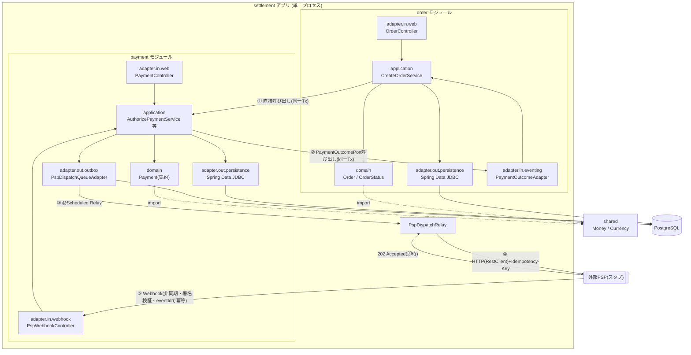
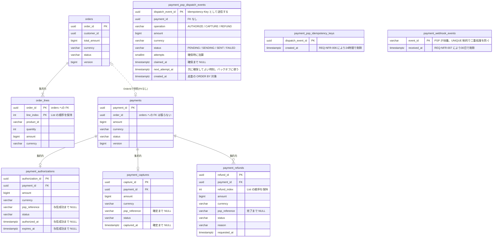
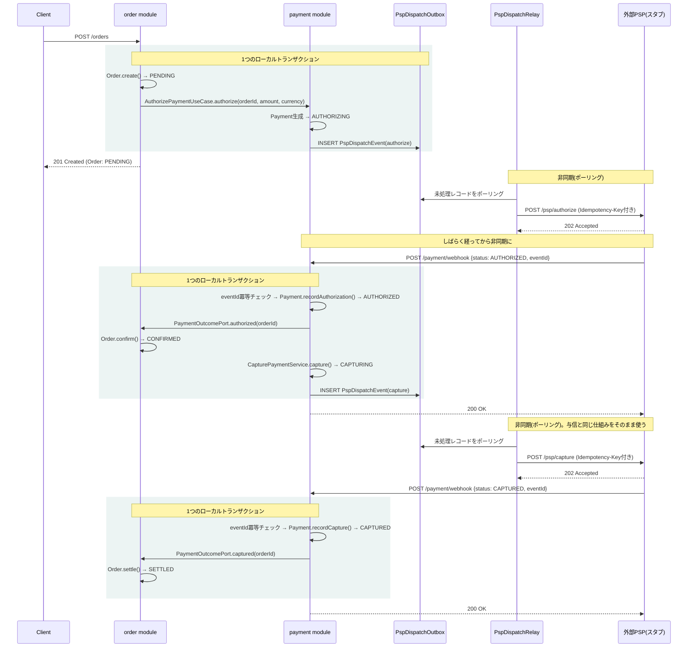
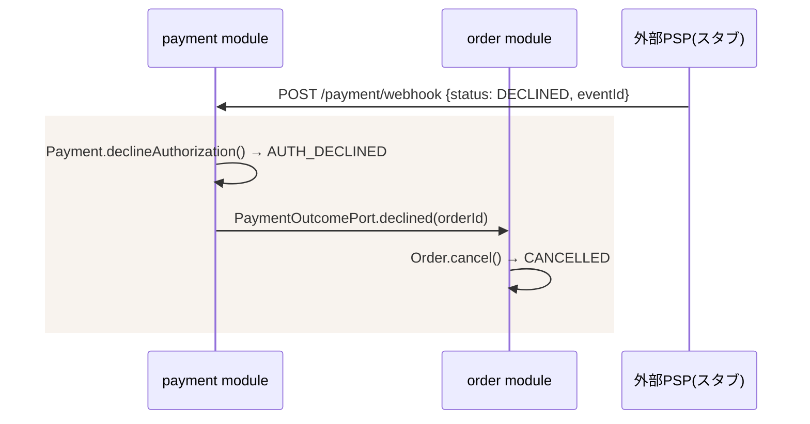
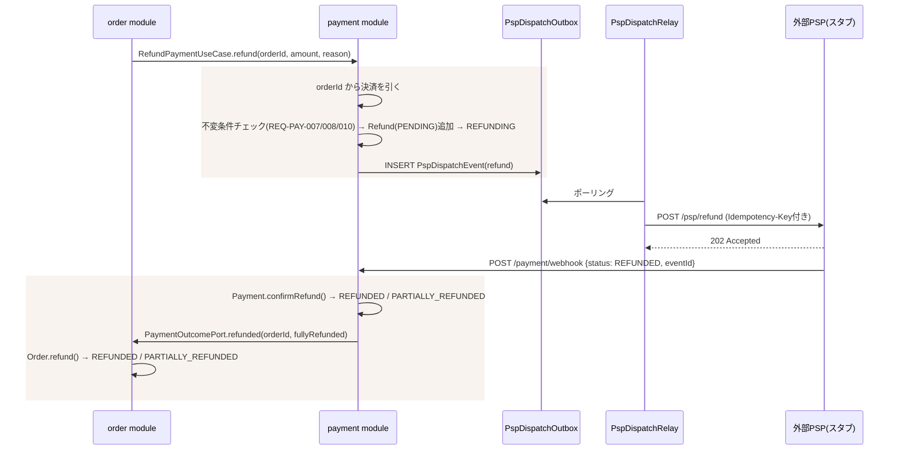

# 決済ドメインの実装設計

> 本書は**どう作るか**(アーキテクチャ・パッケージ構成・実装方式)を扱う。
> - なぜそうなのか(業務言語・業務ルール): [ubiquitous-language.md](./ubiquitous-language.md)
> - 何を満たすべきか(要件ID・状態遷移・非機能要件の具体値): [requirements.md](./requirements.md)
> - いつ作るか(実装の順序と完了条件): [plan.md](./plan.md)
>
> 業務ルールの変更は`ubiquitous-language.md`、要件の変更は`requirements.md`を先に更新し、本書を追随させること。

**技術前提**

- `com.example.settlement`（Maven artifactId: `settlement`）/ Java 21 / Spring Boot 4.1
- Spring Data JDBC + PostgreSQL + Flyway（JPAではない点に注意）
- Spring Web MVC、Validation、Actuator、Lombok
- Kafka 等の外部ブローカーは使わない（`compose.yaml` は `app` + `db` の2コンテナのみ）

---

## 1. 設計方針

- **モジュラーモノリス**: `order` / `payment` を境界づけられたコンテキストとしてトップレベルパッケージで分離し、各コンテキスト内を`domain` / `application` / `adapter`の3層にし、`adapter`をin/outで分ける。
- **自社ドメイン同士(Order⇔Payment)はローカルトランザクションで保証する**。Outboxは使わない。依存の向きは `order → payment` の一方向のみに固定する。
  - Order起点の呼び出し(与信・売上確定・返金の要求)は、`order`が`payment`のユースケース(port.in)を直接呼ぶ同期呼び出し。同一トランザクションに乗せられる。
  - Payment起点の通知(PSPからの結果が確定した後、Orderの状態を進める)は、`payment`が`order`を直接呼ばず、`payment.application.port.out`に自分で定義した`PaymentOutcomePort`インターフェース経由で行う。実装(`PaymentOutcomeAdapter`)は`order`側が用意し、DIで解決される。`payment`は「誰が実装しているか」を一切知らない。これにより`payment → order`の依存を作らず、循環依存を避ける。ただのメソッド呼び出しなので、呼び出し元のトランザクションにそのまま乗り、Payment更新とOrder更新は自然に1つのローカルトランザクションとして確定する。
- **本物の分散トランザクションはPayment⇔外部PSPのみ**。ここだけTransactional Outbox(以下「PSP Dispatch Outbox」)を使う。PaymentがPSPへ送るべきコマンドをローカルTxでOutboxテーブルにinsertし、`@Scheduled`のRelayが非同期にPSPへHTTPで送信する。
- **PSPからの応答はWebhookで非同期に受ける**(REQ-PSP-005〜008)。PSP呼び出し直後の同期レスポンスは受け付け確認(`202 Accepted`)のみとして扱い、最終結果は後から届くWebhookで確定させる。
- **Spring Data JDBCとの相性**: JDBCは「集約ルート以外にリポジトリを作らせない」設計になっているため、Payment集約の中にAuthorization/Capture/Refundを子エンティティとして持たせる構造(決済台帳に近い形)と相性が良い。



①②は自社ドメイン内なのでローカルトランザクション、③④⑤だけが本物の非同期・分散処理になる。この線引きが本設計の核。

---

## 2. パッケージ構成

```
com.example.settlement
├── order                        # 境界づけられたコンテキスト: 注文
│   ├── domain                   # Order, OrderId, CustomerId, OrderLine, ProductId, Quantity,
│   │                            # OrderStatus
│   │                            # ※Moneyはshared.Moneyをimportして使う(orderで再定義しない)
│   ├── application
│   │   ├── port.in              # 顧客起点: CreateOrderUseCase, RequestRefundUseCase
│   │   │                        # 結果の反映: ConfirmOrderUseCase, CancelOrderUseCase,
│   │   │                        #   SettleOrderUseCase, FailOrderSettlementUseCase, RefundOrderUseCase
│   │   │                        # ※前者はWebから、後者は PaymentOutcomeAdapter から呼ばれる
│   │   ├── port.out             # OrderRepository(※集約ルート経由でのみ入出力)
│   │   └── service              # CreateOrderService / RequestRefundService
│   │                            #   (内部でpaymentのUseCaseを直接呼ぶ),
│   │                            # ConfirmOrderService, CancelOrderService, SettleOrderService,
│   │                            # FailOrderSettlementService, RefundOrderService
│   │                            # ※集約のロードと保存、トランザクション境界はここが持つ。
│   │                            #   PaymentOutcomeAdapter はIDの詰め替えと委譲だけに留める
│   └── adapter
│       ├── in                   # orderを駆動する側
│       │   ├── web              # OrderController(POST /orders, POST /orders/{id}/refunds),
│       │   │                    # DTO, GlobalExceptionHandler
│       │   └── eventing         # PaymentOutcomeAdapter implements PaymentOutcomePort
│       │                        # （paymentからの結果通知を受けてorderのUseCaseを呼ぶ）
│       └── out                  # orderが依頼する側
│           └── persistence      # 永続化専用モデル + マッパー + Spring Data JDBC Repository実装
│
├── payment                      # 境界づけられたコンテキスト: 決済
│   ├── domain                   # Payment(集約ルート), PaymentId, OrderId, PaymentStatus,
│   │                            # Authorization, AuthorizationId, AuthorizationStatus,
│   │                            # Capture, CaptureId, CaptureStatus,
│   │                            # Refund, RefundId, RefundStatus, RefundReason
│   │                            # ※OrderIdはpayment側で独自に定義する(order.domain.OrderIdとは別の型)。
│   │                            # 決済は注文を単なる参照としてしか扱わないため(UL §5)
│   │                            # ※Moneyはshared.Moneyをimportして使う
│   ├── application              # AuthorizationProperties(settlement.psp.authorization-validity のバインド先。
│   │   │                        #   読み手がapplication層のため、adapter配下の既存レコードには置けない)
│   │   ├── port.in              # AuthorizePaymentUseCase, RefundPaymentUseCase
│   │   │                        # ↑ orderから直接呼ばれる入口はこの2つのみ。
│   │   │                        #   返金は注文IDを起点に届くため、決済の特定は payment 側で行う
│   │   │                        #   (RefundPaymentUseCase#refund(OrderId, Money, RefundReason))
│   │   │                        # HandlePspWebhookUseCase(Webhookの入口から呼ばれる)と、
│   │   │                        #   その引数・戻り値の PspWebhookNotification / PspWebhookStatus / WebhookOutcome
│   │   ├── port.out             # PaymentOutcomePort（← orderモジュールが依存してよい唯一の公開interface）,
│   │   │                        # PaymentAuthorized/AuthDeclined/Captured/CaptureFailed/Refunded
│   │   │                        #   （PaymentOutcomePortの引数となるレコード）,
│   │   │                        # PspDispatchQueuePort, WebhookEventStorePort,
│   │   │                        # PaymentRepository(※集約ルート経由でのみ入出力)
│   │   └── service               # AuthorizePaymentService, RefundPaymentService, HandlePspWebhookService
│   │                             # CapturePaymentService(port.inを持たない内部専用サービス。
│   │                             #   HandlePspWebhookServiceが与信成功時に直接呼ぶ)
│   └── adapter
│       ├── in                     # paymentを駆動する側
│       │   ├── web                # PaymentController(照会用), GlobalExceptionHandler
│       │   └── webhook             # PspWebhookController(署名検証), PspWebhookRequest(受信DTO。
│       │                           #   フィールド定義をもってWebhookのスキーマ仕様とする), WebhookProperty
│       └── out                    # paymentが依頼する側
│           ├── persistence         # 永続化専用モデル(Payment集約丸ごと) + マッパー + Repository実装
│           ├── outbox               # PspDispatchEventEntity, PspDispatchStatus,
│           │                        # PspDispatchQueueAdapter(PspDispatchQueuePortの実装),
│           │                        # PspDispatchRelay(走査の中身),
│           │                        # PspDispatchScheduler(@Scheduled。起動の契機のみ),
│           │                        # PspDispatchStore, PspDispatchProperties
│           ├── gateway               # PspClient(RestClient)。PspDispatchRelayが送信に使う
│           └── idempotency            # WebhookEventJdbcStore(受信側の冪等性),
│                                      # WebhookEventCleaner(@Scheduled。REQ-NFR-007), WebhookEventProperty
│
├── shared                          # Money, Currency。orderとpaymentが共有するShared Kernel。
│                                    # 業務ロジックは持たず、通貨計算等の普遍的な不変条件のみを持つ。
│                                    # ArchUnitで「sharedはorder/paymentに依存しない」ことを検証する(§7)
│
├── pspsimulator                     # 演習用: 外部PSPを模したスタブ(実プロダクトなら別リポジトリ/別サービス)
│   ├── FakePspController             # /psp/authorize /psp/capture /psp/refund → 即座に202 Acceptedを返す
│   │                                 # 手動再送の入口 /psp/webhooks/resend/{paymentId} もここ(REQ-SIM-007)
│   ├── PspIdempotencyKeyStore         # PSP側の冪等性キーストア([ADR-0002](./adr/0002-idempotency-key-store-on-psp-side.md))
│   ├── PspIdempotencyKeyCleaner       # @Scheduled。保持期間を過ぎたキーを削除する(REQ-NFR-006)
│   ├── PspSimulatorProperty           # settlement.pspsimulator.* のバインド先
│   └── WebhookDispatcher              # TaskSchedulerによる遅延実行で settlement アプリへWebhookをPOSTする。
│                                      # 手動再送のため、送信した本文を決済ごとにメモリに保持する
│
└── SettlementApplication.java
```

**ポートの基準**: アプリケーション層が外部に依頼する操作はすべて`application.port.out`にインターフェースとして定義し、実装を`adapter.out`(または他モジュール)に置く。集約のリポジトリも例外としない。`domain`はモデルのみを持ち、外部との接点を一切持たない。

**アダプタの基準**: DBもUIも等しく「外部」として扱い、駆動する側(`adapter.in`)と依頼される側(`adapter.out`)で分ける。`port.in`を呼ぶものが`adapter.in`、`port.out`を実装するものが`adapter.out`と対応する。`PaymentOutcomeAdapter`は`payment`の`port.out`を実装するが、`order`から見ると`order`のUseCaseを呼んで駆動する側なので`order.adapter.in`に置く。

**依存の向き**: `order → payment`（`payment.application.port.out`のみ）の一方向。`payment`パッケージは`order`を一切importしない。`PaymentOutcomePort`の実装(`PaymentOutcomeAdapter`)は`order`側が用意し、Spring DIが自動的に解決する。`shared`は例外的に`order`・`payment`の両方からimportされてよいが、`shared`自身は`order`・`payment`のどちらにも依存しない(依存は常に外側から`shared`への一方向)。`pspsimulator`は演習用の外部システム代役であり、`payment`とはHTTP経由でのみ繋がる。

---

## 3. ドメインモデルの実装方針

### Payment集約の構造

| 要素 | 種別 | 内容 |
|---|---|---|
| `Payment` | 集約ルート | PaymentId, OrderId, 金額, `PaymentStatus`, `Authorization`(0..1), `Capture`(0..1), `Refund`のリスト(0..n) |
| `Authorization` | エンティティ | authorizationId, amount, pspReference, `AuthorizationStatus`, authorizedAt, expiresAt |
| `Capture` | エンティティ | captureId, amount, pspReference, `CaptureStatus`, capturedAt |
| `Refund` | エンティティ | refundId, amount, pspReference, `RefundStatus`, reason, requestedAt |

各状態の値と遷移は[requirements.md §2](./requirements.md)で定義する。実装上の扱いは以下のとおり。

- `PaymentStatus`は子エンティティからの導出値ではなく、`payments`テーブルの列として永続化する。滞留中の決済(`*_ING`)を状態列だけで抽出できるようにするため。整合性は`Payment`集約が子エンティティの更新と同時に自ら維持する
- 状態はすべてJavaのenumとして定義し、遷移の可否はenum自身または集約のメソッドで判定する。文字列比較で分岐させない
- ドメインモデルにはフレームワークのアノテーションを付けない(§7)。`@Id`や`@MappedCollection`を伴う永続化専用モデルは`adapter.out.persistence`に別途置き、リポジトリ実装が集約との相互変換を担う
- 楽観ロックのため、集約ルートはアノテーションを持たない`long version`を保持する。`@Version`が付くのは永続化モデル側。Spring Data JDBCでは子エンティティのバージョンは扱えないため、`Payment`集約ルートにのみ持たせる
- リポジトリ実装は、読み込み時と保存後の双方でバージョンを集約へ書き戻す(`Payment#applyPersistedVersion`)。Spring Data JDBCは`save()`が返すインスタンスにのみバージョンを加算し、またその値でINSERT/UPDATEを判定するため、書き戻しを怠ると既存集約の保存がINSERTとして発行される。
  - **同一トランザクション内で同じ集約を2回保存する経路で顕在化する。** 与信成功をそのまま売上確定へ進める箇所(REQ-PAY-004)がこれにあたり、書き戻しがないと2回目が古いバージョンで更新を試みて楽観ロックに失敗する
- REQ-PAY-011の「直前の状態」は返金累計額から導出する(累計が0なら`CAPTURED`、0より大きければ`PARTIALLY_REFUNDED`)。直前の状態を保持する列は設けない。この累計は`RefundStatus.REFUNDED`の子のみを対象とする。REQ-PAY-008の超過判定では`PENDING`の返金も含める必要があるため、両者で集計対象が異なる

### 不変条件の置き場所

REQ-PAY-005〜008、REQ-PAY-010の各不変条件は、`Payment`集約のメソッド内で判定する(REQ-PAY-012)。application層のserviceにif文として書いてはならない。呼び出し側が検査を忘れても集約が自衛できる状態を保つため。

```java
// 良い例: 集約が自分で守る
payment.capture(amount);   // 内部で与信額・有効期限・PENDING重複を検査し、違反なら例外

// 悪い例: application層で検査する
if (amount.isGreaterThan(payment.authorizedAmount())) { throw ...; }
```

### コンテキスト間モデル

| コンテキスト | 集約ルート | 主な値オブジェクト | ドメインイベント |
|---|---|---|---|
| Order | Order | OrderId / CustomerId / OrderLine / ProductId / Quantity / Money | OrderCreated / OrderConfirmed / OrderCancelled / OrderSettled / OrderRefunded |
| Payment | Payment | PaymentId / Money | PaymentAuthorized / PaymentAuthDeclined / PaymentCaptured / PaymentCaptureFailed / PaymentRefunded / PaymentPartiallyRefunded |

### 永続化



`payment_psp_dispatch_events`には`(created_at)`の部分索引を`WHERE status IN ('PENDING','SENDING')`で張る。`SENT`は削除されず蓄積するため、走査対象を処理待ちの行だけに限定する。

**外部キーは集約の内側にのみ張る。** `payments`が`orders`を参照する箇所と、Outbox・冪等性の3テーブルには張らない。前者は境界づけられたコンテキストをまたぐため、後者は業務データとは独立した仕組みであるため。将来サービスとして分割する際、外部キーがあるとテーブルを別DBへ移せなくなる。

`payment_psp_dispatch_events`・`payment_psp_idempotency_keys`・`payment_webhook_events`は集約ではない。`Payment`集約の永続化とは別のアダプタが読み書きする。

カラム定義・制約・インデックスはマイグレーションファイル自体を仕様とする(二重管理を避ける)。上図に載せているのは主キーと関連のみ。`order`側にはOutboxテーブルを持たない。

| マイグレーション | 追加するもの | 実装したステップ |
|---|---|---|
| `V1__init` | `orders` / `order_lines` / `payments` / `payment_authorizations` / `payment_psp_dispatch_events` | 1 |
| `V2__psp_idempotency_keys` | `payment_psp_idempotency_keys` | 2 |
| `V3__psp_dispatch_next_attempt_at` | `next_attempt_at` 列(バックオフ) | 2 |
| `V4__payment_webhook_events` | `payment_webhook_events` | 3 |
| `V5__payment_captures` | `payment_captures` | 4 |
| `V6__payment_refunds` | `payment_refunds` | 5 |

---

## 4. 処理フローとコンポーネント間の呼び出し

各操作は「業務データの更新とディスパッチレコードのinsertを同一トランザクションで行う」→「Relayが非同期に送信」→「Webhookで結果を受けて状態を確定させ、同一トランザクション内で`PaymentOutcomePort`を呼ぶ」という同一のサイクルを辿る。与信・売上確定・返金でこの構造は変わらない。

売上確定は`order`から呼ばれる入口(port.in)を持たず、`HandlePspWebhookService`が与信成功を確定させるのと同一トランザクション内で`CapturePaymentService`を直接呼ぶ(REQ-PAY-004)。

### 正常系(与信 → 売上確定)



クライアントは`POST /orders`の時点でOrderの最終確定を待たず、`PENDING`のまま応答を受け取る。確定はWebhook到達後に反映される。

### 与信拒否



売上確定失敗も同じ形で、`PaymentOutcomePort.captureFailed()` → `Order`を`SETTLEMENT_FAILED`へ遷移させる。

### 返金



`POST /orders/{id}/refunds` は `202 Accepted` を返す。受け付けた時点ではPSPへ依頼しただけで、返金は成立していない。注文が進むのはWebhook到達後(REQ-ORD-006)。

**返金失敗では注文側へ通知しない。** `Payment`は直前の状態へ戻る(REQ-PAY-011)が、`Order`は`SETTLED`/`PARTIALLY_REFUNDED`のまま動かない。返金が成立していない以上、注文から見れば何も起きていないため。

### 返金だけが持つ難しさ

与信と売上確定は子エンティティが0..1で、状態遷移も一方向だった。返金は0..nのコレクションになり、2点が変わる。

**同じ「累計」でも集計対象が2つある。**

| 用途 | 対象 | 理由 |
|---|---|---|
| 超過判定(REQ-PAY-008) | `REFUNDED` + `PENDING` | 結果待ちのあいだに超過する要求を通さないため |
| 直前の状態の導出(REQ-PAY-011) | `REFUNDED` のみ | 成立していない返金は「返した金額」ではないため |

**直前の状態を列で持たない。** 返金失敗時に`CAPTURED`と`PARTIALLY_REFUNDED`のどちらへ戻るかは、確定済み累計が0かどうかで導出する(§3)。状態を二重に持つと、集約の状態と子の状態が食い違う余地が生まれる。

**処理中の返金はたかだか1件。** REQ-PAY-010が保証するため、返金完了のWebhookは「唯一のPENDINGな`Refund`」に適用すればよく、どの返金への通知かをペイロードで識別する必要がない。

---

## 5. 外部PSP境界の実装方針

- `PspDispatchQueuePort`（application/port.out）に「PSPへ送るべきコマンドをキューに積む」操作を定義。実際の送信は`adapter.out.outbox.PspDispatchRelay`が担い、`adapter.out.gateway.PspClient`(RestClient)でHTTP呼び出しする。定期実行の契機は`PspDispatchScheduler`(`@Scheduled`)が別クラスとして与える(理由は§9.1)。
- **ディスパッチの走査と送信**: 詳細は§5.1。
- **送信失敗時**: 指数バックオフで再送し、上限(REQ-NFR-002)を超えたレコードは`FAILED`として送信を止める。
- **送信側の冪等性**: `Idempotency-Key`にはディスパッチレコードのIDをそのまま用い、リトライ時も同じ値を送る。settlement側にキーは記録しない。受付済みキーの判定はPSP側の責務であり、`payment_psp_idempotency_keys`は`pspsimulator`が読み書きする([ADR-0002](./adr/0002-idempotency-key-store-on-psp-side.md))。
- **署名検証**: Webhookの共有シークレットによるHMAC署名ヘッダーを`PspWebhookController`で検証する。形式は`X-Psp-Signature: t=<epoch秒>,v1=<hex64>`で、署名対象は`t + "." + リクエストボディ`。時刻を署名に含めることで、盗まれた署名の再利用を許容時間の経過で無効化する。`v1`はアルゴリズムを変更する際に併記して移行するための版番号。
  - **ボディは解釈前の文字列のまま検証する**。`@RequestBody String`で受け、検証を通してから`ObjectMapper`でDTOへ変換する。パースして再度シリアライズすると、キーの順序・空白・未知のフィールドの欠落でバイト列が変わり、署名が一致しない。
  - **突き合わせは`MessageDigest.isEqual`で行う**。`String.equals`は不一致の位置で比較を打ち切るため、応答時間の差から正しい署名を絞り込める余地が残る。
- **受信側の冪等性**: Webhookペイロードの`eventId`を`payment_webhook_events`に記録し、UNIQUE制約で二重処理を防ぐ。判定は集約を更新する前に行い、挿入できた側だけが処理権を得る。先に集約を更新すると、同時に届いた2つが両方とも更新に進む余地が生まれる。
- **Webhookのペイロード**: `PspWebhookRequest`のフィールド定義をもって仕様とする([requirements.md §7](./requirements.md))。
  ```json
  {"eventId":"evt-…","paymentId":"<uuid>","pspReference":"psp-…","status":"AUTHORIZED"}
  ```
  `status`は`AUTHORIZED`または`DECLINED`。`pspReference`は`null`を許容する(拒否時は記録しないため)。「与信成功には参照IDが必要」という規則は`Payment`集約が持つので、受信DTO側では検証しない(§3)。
- **応答は200と401の2種類のみ**: 署名検証に失敗した場合だけ`401`を返し、それ以外は適用できたか・重複か・適用できなかったかによらず`200`を返す。エラーを返すとPSPが再送を繰り返すため。3つの結末は`WebhookOutcome`(`APPLIED` / `DUPLICATE` / `NOT_APPLICABLE`)として`HandlePspWebhookUseCase`の戻り値に現れる。
  - 適用できなかった理由を持つのは、集約の更新を試みて`IllegalStateException`を受け取った`HandlePspWebhookService`だけなので、WARNログはそこで出す。Controllerまで上がるのは3値の1つでしかなく、どの状態に何が届いたかを書けない。
- **適用できないWebhook**: 現在の状態に適用できない通知を受けた場合も、状態を変えずに`200 OK`を返す(REQ-PSP-007)。エラーを返すとPSPが再送を繰り返すため。
- **素早くACKする**: `PspWebhookController`は署名検証・冪等チェック・状態更新までを1トランザクションで完結させ、重い処理を後回しにしない。
- **`pspsimulator`**: 全エンドポイントで`202 Accepted`のみを返し、結果は`WebhookDispatcher`が遅延送信する。可否判定は金額に基づくルールで行う。ランダムにするとE2Eテストが不安定になるため。

  | 操作 | 失敗する金額の下2桁 | 根拠 |
  |---|---|---|
  | 与信 | `99` | REQ-SIM-003 |
  | 売上確定 | `98` | REQ-SIM-004 |
  | 返金 | `97` | 要件に定めがないため、上2つと同じ形に揃えた |

- **遅延送信は`TaskScheduler`で行う**: `schedule(Runnable, Instant)`は時刻ベースなので、待機中にスレッドを消費しない。`@Async`と`Thread.sleep`の組み合わせは待っているあいだプールを占有するため使わない。スケジューラが`Runnable`の例外を握り潰す点に注意し、送信処理は自前で捕まえて記録する。
- **手動再送**(REQ-SIM-007): 送信した本文を決済ごとにメモリ(`ConcurrentHashMap`)へ保持し、`POST /psp/webhooks/resend/{paymentId}`で送り直す。**本文はそのまま送る**ため`eventId`が変わらず、受信側では重複として弾かれる。これが受信側の冪等性(REQ-PSP-006)を実演する手段になる。署名の`t`だけは送信のたびに取り直す。原本の値を使い回すと、許容時間を過ぎた再送が自分の署名で弾かれるため。

### 5.1 ディスパッチの走査・送信・回収

#### ディスパッチレコードの状態

| 状態 | 意味 |
|---|---|
| `PENDING` | 未送信。走査の対象 |
| `SENDING` | Relayが確保済み。送信中 |
| `SENT` | PSPが`202 Accepted`で受理した。**決済の成否ではない**(結果はWebhookで別途確定する) |
| `FAILED` | 試行回数が上限(REQ-NFR-002)に達した。以降は拾わず、人手で調査する |

```
PENDING ──確保──→ SENDING ──202受理──→ SENT
   ↑                  │
   │                  ├──送信失敗──→ PENDING (next_attempt_at を設定してバックオフ。§後述)
   │                  │
   └──回収────────────┘ (claimTimeout を過ぎても SENDING のまま。§後述)

   attempts が上限に達したら → FAILED
```

#### 走査(確保)

`SELECT ... FOR UPDATE SKIP LOCKED`で未送信レコードを確保する。`FOR UPDATE`だけでは他インスタンスが待たされて直列化してしまうため、`SKIP LOCKED`でロック済みの行を待たずに読み飛ばし、各インスタンスが重複しない集合を並行して処理できるようにする。

```sql
SELECT * FROM payment_psp_dispatch_events
 WHERE (status = 'PENDING' AND next_attempt_at <= now())                  -- 未送信 + バックオフ明け
    OR (status = 'SENDING' AND claimed_at < now() - interval '1 minute')  -- 回収対象
 ORDER BY created_at
 LIMIT 10
 FOR UPDATE SKIP LOCKED;
```

#### 確保と送信を分ける

HTTP呼び出しをトランザクション内で行うと、応答待ちの数秒間ずっと行ロックとDBコネクションを占有してしまう。そのため確保と送信を別トランザクションに分割する。

```
BEGIN;
  SELECT ... FOR UPDATE SKIP LOCKED     -- 担当分を確保
  UPDATE SET status='SENDING', claimed_at=now(), attempts=attempts+1
COMMIT;                                  -- ロック解放

  → PSPへHTTP送信(トランザクション外)

BEGIN;
  UPDATE SET status='SENT'
        もしくは status='PENDING', next_attempt_at=(バックオフ明けの時刻)
        もしくは status='FAILED'(試行上限に達した場合)
COMMIT;
```

**`attempts`は送信失敗時ではなく確保時に加算する**。送信前にプロセスが落ちた場合でもカウントが進むため、毎回クラッシュを引き起こすレコードが無限に再試行され続けることを防げる。

#### 送信失敗時のバックオフ

送信に失敗した行は`PENDING`へ戻し、次に確保してよい時刻を`next_attempt_at`に書く。待機時間はRelayが計算する(`backoffBase × 2^(attempts-1)`。REQ-NFR-002)。走査クエリはこの時刻を過ぎるまでその行を拾わない。

**待つあいだ行を確保したままにしない。** Relayのスレッドを塞がずに済み、他の行の送信が遅れない。確保したまま待つと`claimTimeout`を超えて占有することになり、処理中の行を他インスタンスが回収して二重に送信する。

待機の状態をDBに持つため、プロセスが再起動しても失われず、複数インスタンス間でも認識がずれない。

上限に達した時点で`FAILED`にする。`FAILED`は終端であり、走査クエリと部分索引のどちらも対象外としているため自動では再送されない。以降は人手で対応する。

#### 取り残された行の回収

`SENDING`にした直後、HTTP送信の前にプロセスが落ちる(OOM・kill・デプロイによる再起動)と、その行は`PENDING`ではないため通常の走査対象から外れ、**永久に処理されないまま放置される**。例外もログも出ないため誰も気づかない。

これを防ぐため、`claimed_at`から一定時間(1分)を過ぎても`SENDING`のままの行を、送信されなかったものとみなして再度走査対象に含める(上記クエリのOR条件)。回収専用のスケジューラは設けない。ただし回収の発生は異常の兆候であるため、WARNログに記録する。

タイムアウトは正常な送信にかかる最大時間より十分長く取る。1回の確保で行うのは1度の送信だけであり、読み取りタイムアウトが5秒(REQ-NFR-003)であるのに対し1分を設定しているため、処理中の行を誤って横取りする余地はほぼ無い。バックオフの待機はこの時間に含まれない。行を`PENDING`へ戻してから待つためである。

**再送が安全である根拠**: プロセスが落ちた位置は「送信前」か「送信後・結果記録前」のいずれかである。前者なら再送が初回送信となり正しい。後者ならPSPには2回目の到達となるが、`Idempotency-Key`が同一であるためPSP側が重複と判定して処理しない(REQ-PSP-003 / REQ-SIM-005)。**つまりこの回収処理は冪等性キーの存在を前提として初めて成立する**。冪等性キーが無ければ二重決済になる。

キーには保持期間がある(REQ-NFR-006)ため、回収はキーが消える前に起きなければならない。`claimTimeout`(1分)を保持期間(24時間)より十分短く取ることで満たす。Relayが保持期間を超えて停止し続けることはない想定とする。

### 5.2 保持期間の掃除

冪等性のための2つのテーブルは参照されないまま増え続けるため、保持期間を過ぎた行を`@Scheduled`で削除する。

| テーブル | 保持期間 | 削除するクラス |
|---|---|---|
| `payment_webhook_events` | 30日(REQ-NFR-007) | `payment.adapter.out.idempotency.WebhookEventCleaner` |
| `payment_psp_idempotency_keys` | 24時間(REQ-NFR-006) | `pspsimulator.PspIdempotencyKeyCleaner` |

**消しすぎると壊れる。** 冪等性の記録は「この処理はもう行った」という証拠であり、消えた後に重複が届くと初回と判定して再実行してしまう。冪等性キーの保持期間は`claimTimeout`(1分)より十分長く取る必要がある。回収した行を再送する際にキーが残っていることが、二重決済を防ぐ根拠だからである(§5.1)。

**同じ形のクラスを2つ置き、`shared`へ共通化しない。** 前者は`payment`、後者は`pspsimulator`とモジュールが異なる。共通化すると`shared`が`JdbcClient`を持つことになり、Shared Kernelの位置づけから外れる。また「本番コードは`pspsimulator`に依存しない」というArchUnitのルールにも触れる。

### 設定値

具体的な数値は[requirements.md §4](./requirements.md)で定義する。実装ではハードコードせず`application.properties`から注入し、テスト時に短縮できるようにする。

```properties
# settlement 側
settlement.psp.dispatch.polling-interval=1s
settlement.psp.dispatch.max-attempts=5
settlement.psp.dispatch.backoff-base=1s
settlement.psp.dispatch.claim-timeout=1m
settlement.psp.dispatch.batch-size=10
settlement.psp.dispatch.enabled=true
settlement.psp.base-url=http://localhost:8080
settlement.psp.connect-timeout=3s
settlement.psp.read-timeout=5s
settlement.psp.authorization-validity=7d
settlement.psp.webhook-event-retention=30d
settlement.psp.webhook-secret=${PSP_WEBHOOK_SECRET:local-development-secret}
settlement.psp.webhook-signature-tolerance=5m

# PSPシミュレータ側
settlement.pspsimulator.webhook-url=http://localhost:8080/payment/webhook
settlement.pspsimulator.webhook-delay-min=1s
settlement.pspsimulator.webhook-delay-max=5s
settlement.pspsimulator.webhook-connect-timeout=3s
settlement.pspsimulator.webhook-read-timeout=5s
settlement.pspsimulator.webhook-secret=${PSP_WEBHOOK_SECRET:local-development-secret}
settlement.pspsimulator.idempotency-key-retention=24h
```

**プレフィックスで受信側と送信側を分ける。** `settlement.psp.*`がsettlementの設定、`settlement.pspsimulator.*`がシミュレータの設定。`idempotency-key-retention`が後者にあるのは、冪等性キーがPSP側の状態だからである([ADR-0002](./adr/0002-idempotency-key-store-on-psp-side.md)と同じ理由)。共有シークレットが両方に現れるのは、実プロダクトで別サービスがそれぞれ同じ鍵を持つ形と一致する。

`webhook-signature-tolerance`は署名に含まれる時刻の許容範囲。これを過ぎた署名は再利用できない。判定は過去方向のみで行う。送信側と受信側が同一プロセスで動く以上、時計のずれが起きないためである。将来シミュレータを本物のPSPに置き換える際は、未来方向の判定も検討すること。

`enabled`はRelayを動かすかの切り替え。テストでは既定で`false`にし、Relayを動かすテストだけが有効化する。走査が他のテストのデータを拾って非決定的になるのを避けるため。

---

## 6. 実装上の要点

- **Outboxのスコープを絞る**: Outboxは`payment`モジュール内の「PSPへ送るべきコマンド」専用。Order⇔Payment間には作らない。
- **モジュール間の疎結合はカスタムport(Dependency Inversion)で実現する**: `PaymentOutcomePort`を`payment`自身が定義し、実装は`order`側が提供してDIで解決される。Springのイベント機構を使わないため、フェーズ(コミット前/後)を意識せずとも呼び出し元のトランザクションにそのまま乗る。既存のport.in/port.outパターンと一貫しており、モックによる単体テストも容易。
- **冪等性は送信側・受信側の両方に必要**: 送信は`Idempotency-Key`、受信は`eventId`。片方だけでは不十分。
- **現在時刻は`java.time.Clock`をBeanとして注入する**: `SettlementApplication`で`@Bean Clock clock()`を登録し、必要なクラスがコンストラクタで受け取る。`shared`に`ClockPort`は作らない。`java.time.Clock`が既に同じ抽象であり、ポートを重ねても得るものがないため。ドメインは`Instant`と`Duration`を引数で受け取るだけに保ち、フレームワークにも現在時刻にも依存しない(例: `Payment.recordAuthorization(pspReference, authorizedAt, validity)`)。テストでは`Clock.fixed()`を渡して時刻を固定する。ステップ2までに書いたアダプタ3箇所の`Instant.now()`直接呼び出しは残っている。
- **不変条件はPayment集約に閉じ込める**(§3)。
- **状態遷移を明示する**: 各操作は必ず`PENDING`系を経由してから最終状態に落ち着く状態機械として実装し、許可されない遷移は実行時に弾く。
- **テスト戦略**: domain層(Payment集約の不変条件)は純粋なユニットテストで手厚く。`payment`⇔PSP間はWireMock等でHTTPスタブ化し、202応答・遅延Webhook・重複Webhook・署名検証エラーのケースを検証する。
- **テストに要件IDを書く**: 各テストの`@DisplayName`に対応する要件ID(`REQ-PAY-005`等)を含める。要件とテストの対応が追跡でき、テストの無い要件を未実装として検出できる([requirements.md §1](./requirements.md))。

---

## 7. 依存関係の自動検証

§1・§2で定めた依存の向きは、レビューだけに頼らず**ArchUnit**で機械的に検証する。`import`が1行紛れ込むだけで境界が壊れるため。

### 追加する依存関係(pom.xml)

```xml
<dependency>
    <groupId>com.tngtech.archunit</groupId>
    <artifactId>archunit</artifactId>
    <version>${archunit.version}</version>
    <scope>test</scope>
</dependency>
```

### 検証するルール

```java
class ArchitectureTest {

    private static final JavaClasses classes = new ClassFileImporter()
        .withImportOption(ImportOption.Predefined.DO_NOT_INCLUDE_TESTS)
        .importPackages("com.example.settlement");

    @Test
    void paymentMustNotDependOnOrder() {
        noClasses().that().resideInAPackage("..payment..")
            .should().dependOnClassesThat().resideInAPackage("..order..")
            .check(classes);
    }

    @Test
    void sharedMustNotDependOnOrderOrPayment() {
        noClasses().that().resideInAPackage("..shared..")
            .should().dependOnClassesThat().resideInAnyPackage("..order..", "..payment..")
            .check(classes);
    }

    @Test
    void domainMustNotDependOnOuterLayers() {
        noClasses().that().resideInAPackage("..domain..")
            .should().dependOnClassesThat().resideInAnyPackage("..application..", "..adapter..")
            .check(classes);
    }

    @Test
    void applicationMustNotDependOnAdapters() {
        noClasses().that().resideInAPackage("..application..")
            .should().dependOnClassesThat().resideInAPackage("..adapter..")
            .check(classes);
    }

    @Test
    void productionCodeMustNotDependOnPspSimulator() {
        noClasses().that().resideInAnyPackage("..order..", "..payment..", "..shared..")
            .should().dependOnClassesThat().resideInAPackage("..pspsimulator..")
            .check(classes);
    }

    @Test
    void onlyOrderMayImplementPaymentOutcomePort() {
        classes().that().implement("com.example.settlement.payment.application.port.out.PaymentOutcomePort")
            .should().resideInAPackage("..order..")
            .check(classes);
    }

    @Test
    void domainMustNotDependOnFrameworks() {
        noClasses().that().resideInAnyPackage("..domain..", "..shared..")
            .should().dependOnClassesThat().resideInAnyPackage(
                "org.springframework..", "jakarta.persistence..", "jakarta.validation..")
            .check(classes);
    }
}
```

`mvn test`の一部として毎回実行され、以下を保証する。

- `payment`が`order`を一切importしない
- `shared`が`order`/`payment`のどちらにも依存しない(Shared Kernelとしての`Money`が業務ロジックを持ち込む方向に育たないための歯止め)
- 各コンテキストの`domain`層が外側の層に依存しない
- `application`層が`adapter`層に依存しない(依存の向きをport経由に保つ)
- 本番コードが演習用の`pspsimulator`に依存しない(HTTP以外の経路で繋がらない)
- `PaymentOutcomePort`の実装が`order`パッケージ以外に増えない
- `domain`層と`shared`がフレームワークに依存しない(永続化アノテーションをドメインモデルに付けない)

`onlyOrderMayImplementPaymentOutcomePort`は`PaymentOutcomePort`の実装が現れたステップ3で追加した。ArchUnitは対象が0件のルールを失敗として扱うため、実装より先にルールだけを置くことはできない。

### 方式の選定: ArchUnitのみを採用する

依存関係の検証はArchUnitのみで行い、Mavenのマルチモジュール分割は**採用しない**。

Mavenモジュール分割には「依存を`pom.xml`に宣言しないことで、相手のクラスがコンパイル時のクラスパスから物理的に消える」という強みがある。違反はテストを待たずビルド時点で失敗し、IDE上でも入力した瞬間にエラーになる。しかし表現できるのは「モジュール間の依存可否」という粒度に限られ、上記5ルールのうち前半2つしか肩代わりできない。

| ルール | Maven分割 | ArchUnit |
|---|---|---|
| `payment` → `order` の禁止 | 可 | 可 |
| `shared` → `order`/`payment` の禁止 | 可 | 可 |
| `domain`層 → 外側の層 の禁止 | **不可**(1モジュール内のパッケージ関係のため) | 可 |
| `PaymentOutcomePort`の実装者の限定 | **不可**(依存宣言では表現できない) | 可 |
| `domain`層 → フレームワーク の禁止 | **不可**(全モジュールがSpringに依存するため) | 可 |

分割してもArchUnitは引き続き必要であり、その代償として`pom.xml`の増加・ビルド順序の管理・モジュールをまたぐリファクタリングのコストを負うことになる。割に合わないため、単一モジュールを維持する。

**この方式の限界と、その埋め方**: ArchUnitはコンパイルを妨げないため、テストが実行されなければ違反はそのまま通過する。ローカルの`mvn test`だけに頼ると「テストを流さなければ違反したままコミットできる」状態が残る。

これを埋めるためCIを構築する(§9)。`mvn test`がpushごとに必ず走る状態にして初めて、本節のルールが強制力を持つ。

Mavenモジュール分割が意味を持つのは、`order`と`payment`を実際に別サービスとしてデプロイする段階である。そのときは分割自体が目的となるため、副次的にコンパイル時の強制も得られる。

---

## 8. 可観測性

1件の注文が確定するまでに、処理は4回スレッドをまたぐ。どこで何が起きたかを後から追えるようにする(REQ-NFR-008)。

### 8.1 伝搬が切れる場所

```
POST /orders ─────────────────────────┐ 同一スレッド
  CreateOrderService                  │
  AuthorizePaymentService             │
  Outbox に INSERT ─────────────────── ① 行に載せる
PspDispatchRelay(@Scheduled・別スレッド・後の時刻)
  PspClient → HTTP ─────────────────── ② ヘッダで運ぶ
FakePspController
  WebhookDispatcher(TaskScheduler・1〜5秒後) ─ ③ 予約時に捕まえる
  → HTTP ──────────────────────────── ④ ヘッダで運ぶ(※)
PspWebhookController ─────────────────┐ 同一スレッド
  HandlePspWebhookService             │
  PaymentOutcomeAdapter → order       │
```

**MDCだけでは足りない。** MDCはThreadLocalなので①〜④を越えない。①と③はHTTPですらないため、ライブラリによる自動伝搬も効かない。**IDをデータとして持ち回る実装が必要**であり、これはどの方式を選んでも変わらない。

#### ※ ④が繋がるのはシミュレータだからである

**④だけは送信側がこちらではない。** ②はこちらがクライアントなのでヘッダを制御できるが、④のクライアントはPSPにあたる。

現在ヘッダで繋がっているのは、`WebhookDispatcher` が同一サービス内にあり、観測機能付きの `RestClient` を使っているためにすぎない。**本物のPSPが `traceparent` を付ける理由は無い。** 別組織のシステムであり、こちらのトレースを運ぶ義務も動機もない。実PSPへ差し替えれば、Webhook受信以降は別トレースの新しい root になる。

対処は①と同じ形になる。Webhookの本文には `paymentId` が入っており、`traceparent` は `payment_psp_dispatch_events` に永続化してある。受信時にその行を引けば、ヘッダに頼らず元のトレースへ繋ぎ直せる。**伝送路が運んでくれないなら自分のデータから復元する**という点で、①と同じ考え方である。

ただし決済1件に対しディスパッチは複数ある(AUTHORIZE / CAPTURE / REFUND)ため、どの行の `traceparent` を使うかは通知の `status` から決める必要がある。実装していないのは現時点で必要が無いためで、**実PSPへ差し替える際の作業として記録しておく**。

### 8.2 W3C Trace Context を採用する

独自の相関IDではなく、`traceparent`(W3C Trace Context)を伝搬形式とする。

理由は3つ。

- **本プロジェクトの設計判断はすべて「将来の分割」を根拠にしている**(コンテキストをまたぐ外部キーを張らない、`OrderId`を両側で別型にする、`PaymentOutcomePort`で依存の向きを固定する)。伝搬形式だけを独自仕様にするのは一貫しない
- **独自ヘッダは境界を越えない**。実サービスに分割した際、ALBやAPI Gatewayが解釈するのは標準形式であって独自ヘッダではない
- **書く量が減る**。`micrometer-tracing-bridge-otel`を入れると`traceId`/`spanId`が自動でMDCに入る。独自IDだと値オブジェクト・フィルタ・MDCの出し入れを自分で書くことになる

### 8.3 段階

| | アプリ | エクスポーター | 送出先 | 追加コンテナ | 状態 |
|---|---|---|---|---|---|
| 第1段階 | OTel SDK | なし | spanは捨てられ、IDだけがログに残る | 0 | **実装済み** |
| 第2段階 | OTel SDK | OTLP | Jaeger | 1 | **実装済み** |

**どちらも OpenTelemetry である。** 違いは送出先だけで、伝搬形式・コード・永続化する値はすべて共通。

ログはSpring Bootの構造化ログ機能でJSONにする(`logging.structured.format.console=ecs`)。MDCの内容が各行のフィールドとして出るため、追加の依存は要らない。

#### 第2段階で実際に変わったもの

**アプリケーションのコードは1行も変わらない。** 変わったのは次の2点だけで、この主張は `OtlpExportTest` が裏付けている(依存を外すとこのテストだけが落ちる)。

```xml
<!-- pom.xml -->
<dependency>
  <groupId>io.opentelemetry</groupId>
  <artifactId>opentelemetry-exporter-otlp</artifactId>
  <scope>runtime</scope>
</dependency>
```

```properties
# application.properties
management.opentelemetry.tracing.export.otlp.endpoint=${OTLP_ENDPOINT:http://jaeger:4318/v1/traces}
```

**送出先の綴りは実行場所で変わる。** 既定値をサービス名 `jaeger` にしているのは、アプリが devcontainer の `app` コンテナの中で動くため。compose の `ports:` はホストへの公開であって兄弟コンテナには効かないので、コンテナの中から `localhost:4318` では届かない。DBを `jdbc:postgresql://db:5432` で引いているのと同じ事情になる。ホスト側で直接起動する場合は逆になるため、`OTLP_ENDPOINT` で差し替える。

このプロパティに既定値は無い(`OtlpTracingConfigurations$ConnectionDetails` が `@ConditionalOnProperty` で `endpoint` を見ている)。未設定だとエクスポーターのBeanが作られず、**無言で送出されない**。

当初は `spring-boot-starter-opentelemetry` への差し替えを想定していたが、**採らなかった**。あの starter は `spring-boot-starter-micrometer-metrics` と `micrometer-registry-otlp` まで引き込む。メトリクスを使っていない現状では余分な依存になる。必要なのはエクスポーターの成果物1つで、プロパティ(`management.opentelemetry.tracing.*`)は既に入っている `spring-boot-micrometer-tracing-opentelemetry` が定義している。

なお `management.otlp.tracing.endpoint` という短い綴りも通るが、Spring Boot 4.0 で deprecation level が `error` になっている。上記の長い方が現行の綴り。

#### テストでは送出を止める

`src/test/resources/application.properties` で `management.tracing.export.otlp.enabled=false` にしている。テスト中に Jaeger は居ないため、有効のままだと全テストで接続エラーが出続ける。

止めるのは**送出だけ**である点が重要で、span の生成・伝搬とMDCへの注入は動いたまま残る。`management.tracing.export.enabled`(otlp の付かない方)を false にすると伝搬ごと止まり、トレースの継続性を見ているテストが軒並み壊れる。

送出そのものは `OtlpExportTest` が確認する。JDK内蔵のHTTPサーバーを OTLP の受け口に見立てて立て、終了した span の traceId が protobuf の本文に現れることを見る。Docker の有無に依存しないため、CIでもそのまま走る。

#### 動かして見る

**devcontainer の中で動かす場合**(既定)。コンテナに `docker` コマンドは入っていないため、`docker compose up` は使わない。compose の起動は devcontainer 自身が行う。

1. VS Code で「Reopen in Container」。`devcontainer.json` の `dockerComposeFile` により、
   `app` と、その `depends_on` にある `db` / `jaeger` がまとめて起動する
2. コンテナ内のターミナルで起動する

```bash
./mvnw spring-boot:run

curl -X POST localhost:8080/orders \
  -H 'Content-Type: application/json' \
  -d '{"customerId":"11111111-1111-1111-1111-111111111111",
       "lines":[{"productId":"SKU-1","quantity":1,"amount":1000,"currency":"JPY"}]}'
```

**ホスト側で動かす場合**。この場合だけ送出先の綴りが変わる。

```bash
docker compose up -d
OTLP_ENDPOINT=http://localhost:4318/v1/traces ./mvnw spring-boot:run
```

どちらの場合も、ホストのブラウザで `http://localhost:16686` を開き、サービス `settlement` のトレースを選ぶ。**1注文が1本のトレースになっており、その中に §8.1 の4つの非同期境界がすべて入れ子で現れる**。Outbox を経由する箇所(境界①)と `TaskScheduler` の遅延送信(境界③)は、IDをデータとして持ち回らなければ切れていた箇所で、ここが繋がって見えることが第1段階からの成果にあたる。

同じ traceId が構造化ログの各行にも載っているため、ログとトレースは `traceId` で突き合わせられる。Jaeger 自体はログを持たないので、相関は手作業になる。自動で飛べる形にするなら Loki と Grafana が要るが、コンテナが3つ増えるため本演習では採らない。

### 8.4 OpenTelemetry Collector を挟まない

Collectorの価値は運用上の事情に由来する。

| Collectorが解決する問題 | 本プロジェクトでの該当 |
|---|---|
| バックエンドの切り替えをアプリの再デプロイなしで行う | 切り替える先が無い |
| バックエンド障害時の緩衝 | 落ちて困る本番が無い |
| PIIの一括マスク | 送出先がローカルのJaegerのみ |
| tail sampling によるコスト制御 | サンプリング100%で足りる規模 |

**本番運用しない前提のため、挟んでも設定が形式的になる。** 本番であれば、まず tail sampling(エラーになったトレースだけ残す。アプリ側では処理が終わるまで結果が分からないため中央でしか判断できない)と、PIIのマスクのために導入する。

同様にサンプリングは100%とする。絞る理由は保存コストと転送量であり、どちらも発生しない。

### 8.5 Outbox の境界をどう繋ぐか

Relayが数秒後に行を拾って送信するとき、元のトレースの続きとするか、別トレースとしてLinkで参照するかの選択がある。

| 方式 | 結果 |
|---|---|
| **親子(採用)** | 1注文が1本のトレースになる。`POST /orders`のspanは既に終了・送出済みなので、親の所要時間が子を含まない形にはなる |
| Link | OpenTelemetryがメッセージング向けに定める作法。Outboxは実質メッセージキューなので仕様上はこちら |

**親子を採用する。** REQ-NFR-008が求めているのは「1注文分の一連の処理を追跡できる」ことであり、1本のトレースとして見える方が要件に素直なため。規約から外れる選択であることを承知のうえで、業務上の1操作を1トレースとして扱うことを優先する。

### 8.6 実装で最も間違えやすい点

**MDCを必ず消す。** Tomcatのワーカーもスケジューラのスレッドもプールされるため、消し忘れると次の無関係な処理に前のIDが付く。**IDが無いことより、誤ったIDが付いていることの方が有害**で、トレースが自信を持って嘘をつく状態になる。

Relayは**1バッチではなく1行ごと**に出し入れする。10件確保したら10回である。

### 8.7 実装して分かったこと

図の上では繋がって見える箇所が、依存の選び方ひとつで切れる。以下はいずれも計測して判明したもので、コンパイルも起動も通るため気付きにくい。

**Spring Boot 4 では自動設定がモジュールごとに分かれている。** `micrometer-tracing-bridge-otel` を入れただけではMDCが空のままだった。`spring-boot-actuator-autoconfigure` にトレース関連の自動設定は含まれておらず、`spring-boot-micrometer-tracing-opentelemetry` が別途必要になる。

なお `spring-boot-starter-opentelemetry` はOTLPエクスポーターまで含むため第1段階では使わない。送出先が無い状態では接続エラーが出続ける。

**`RestClient.builder()` を自前で呼ぶと伝搬が切れる。** 観測機能が組み込まれていない素のビルダーになり、`traceparent` ヘッダが付かない。注入される `RestClient.Builder`(`spring-boot-restclient` の `RestClientAutoConfiguration` が供給)を使う必要がある。このBeanは `prototype` スコープなので、`PspClient` と `WebhookDispatcher` がそれぞれ `baseUrl` を設定しても干渉しない。

**OTelブリッジでは `TraceContext#parentId()` が null を返す。** OpenTelemetryの `SpanContext` は traceId / spanId / flags / state しか持たず、親のspanIdを保持しない。親子関係はspan生成時に確立され、エクスポート時の `SpanData` には現れるが、実行中のAPIからは読めない。Brave では一級のフィールドなので値が返る。ファサードのAPIが両実装の和集合になっていることによる差。

**関係が失われているわけではない**ため、Jaegerへ送れば入れ子として表示される。テストでは traceId の一致と spanId の相違で継続性を確認している。

**トレースの検証はログよりデータで行う方が確実だった。** 当初は最終段のログに載る traceId を見ようとしたが、`HandlePspWebhookService` は `NOT_APPLICABLE` のときしかログを出さず、正常系では観測できなかった。Outbox の行に記録された `traceparent` を比較する形にすると、タイミングにも依存しない。

この「正常系にログが無い」状態そのものが REQ-NFR-008 に対する欠落だったため、§8.8 の基準を定めたうえで境界の2箇所にINFOを追加した。現在は `AuthorizationCycleTest#theSuccessfulPathEmitsCorrelatedLogs` がログ側からも確認している。

### 8.8 ログ出力基準

トレースが繋がっていても、ログが出ていなければ運用では追えない。出す場所と出さない場所、および1行の形を決める。

#### 出す / 出さない

判断の軸は層ではなく、**その1行だけが答えられる問いがあるか**である。

| 出す | 理由 |
| --- | --- |
| 外部境界を越えた事実 | プロセスの外で起きたことは他に記録が残らない |
| 業務上の判断を下した事実 | 「なぜその分岐になったか」はコードを読んでも再現できない |
| 自力で回復しない異常 | 人手の対応が要る。ERROR |
| 自力で回復する異常 | 頻度が上がれば問題。WARN |

| 出さない | 理由 |
| --- | --- |
| メソッドの入口・出口 | トレースのspanが同じことをより正確に答える |
| 素のDB読み書き | 同上 |
| 同じ事実の二重出力 | 呼ぶ側と呼ばれる側の両方で出さない。**判断を持つ側**で出す |
| 分岐しない中間経過 | 誰も問わない |

**「adapter層で出す」は基準にならない。** adapterで出すべきなのは外部境界を越えた事実だけであり、判断の理由はapplication層にしかない。結果として出力箇所の大半はadapterに寄るが、それは境界がそこにあるためで、層そのものが理由ではない。

量の目安は、正常な1注文あたりINFO数行。

#### 1行の構成

| 仕組み | 適用範囲 | 用途 |
| --- | --- | --- |
| メッセージ本文 | その行 | 発生した事実と、固定句として書ける事由 |
| MDC | その処理中の全行 | 処理を識別するID |
| `addKeyValue`(SLF4J fluent) | その行だけ | その事象固有の値 |

MDCとkey-valueの境目は**トレース由来かどうかではなくスコープ**である。`paymentId` はトレースの仕組みと無関係だが、処理中の全行に付いてほしいのでMDCに置く。`attempts` はその送信1回の事実なのでkey-valueに置く。MDCに入れると後続の行にも同じ値が載ってしまう。

**MDCに置くキー**

| キー | 設定箇所 |
| --- | --- |
| `traceId` / `spanId` | Micrometerが自動で入れる |
| `orderId` | `CreateOrderService`(保存後)、`RequestRefundService`、`PaymentOutcomeAdapter` |
| `paymentId` | `PspWebhookController`、`PspDispatchRelay`、`FakePspController` |
| `eventId` | `PspWebhookController` |
| `dispatchEventId` | `PspDispatchRelay`、`FakePspController` |

`PaymentOutcomeAdapter` は order コンテキストの入口であり、orderId が確定する最初の地点でもある。5つのUseCaseそれぞれで置くと散らばり、置き忘れても誰も気付かないため、ここに集約する。この区間のスレッドには payment 側の `paymentId` と `eventId` が既に載っているので、order 側のログにも両方が載る。

#### 両コンテキストで出す

order と payment は将来の分割を前提に分けている(§1)。片方にしかログが無い状態は、同一プロセスで動いているあいだだけ問題に見えないだけで、分割した瞬間に order 側が無音のサービスになる。したがって**注文の状態遷移は order 側でも記録する**。

| 箇所 | レベル | 記録する事実 |
| --- | --- | --- |
| `CreateOrderService` | INFO | 注文を受け付け、与信を開始した |
| `RequestRefundService` | INFO | 返金要求を受け付け、決済へ引き渡した |
| `ConfirmOrderService` | INFO | 与信成立により確定した |
| `CancelOrderService` | INFO | 与信拒否により取り消した |
| `SettleOrderService` | INFO | 売上確定により完了した |
| `FailOrderSettlementService` | WARN | 売上確定に失敗し要対応になった |
| `RefundOrderService` | INFO | 返金成立により状態を更新した |

`FailOrderSettlementService` だけ WARN にする。`SETTLEMENT_FAILED` は自動で解消しない終端で人手の対応が要るため(REQ-ORD-005)。ERROR にしないのは、システムの障害ではなくPSPが返した業務上の結果であるため。

**payment 側のログと隣接する**点は承知のうえで受け入れる。`HandlePspWebhookService` の「通知を適用した」と `SettleOrderService` の「注文を完了した」は、同じ出来事を別のコンテキストが別の語彙で記録したものであり、二重出力ではない。1注文あたりのINFOは7行程度になる。

`CreateOrderService` のログは、Relayが動いていない場合に注文が存在したことすらログに残らない状態を防ぐ意味もある。`customerId` は顧客の識別子なので載せない。返金要求の `reason` も顧客の自由入力なので載せない(必要なら `payment_refunds` から引ける)。

一方、`ConfirmOrderService` などが呼ぶ `orderRepository.findById` / `save` 自体は記録しない。記録するのは遷移という業務上の事実であって、その実現手段ではない。

#### メッセージ本文

**値を埋め込まない固定文字列**にする。同じ種類の事象を数えられるようにするため。事実と事由の両方を書くが、事由が可変の場合はフィールドへ回す。

| | 本文 | フィールド |
| --- | --- | --- |
| 事由が事象の種類そのもの | 「試行上限に達したため送信を打ち切った」 | — |
| 事由が可変 | 「現在の状態に適用できない通知を受信した」 | `reason`、`error.message` |

#### フォーマット

`logging.structured.format.console=ecs`。1行1JSON。実際の出力は次の形になる(整形は説明用で、実際は1行)。

```json
{
  "@timestamp": "2026-09-23T13:15:56.984737677Z",
  "log":     { "level": "INFO", "logger": "com.example.settlement...SettleOrderService" },
  "process": { "pid": 4734, "thread": { "name": "http-nio-8080-exec-2" } },
  "service": { "name": "settlement", "node": {} },
  "message": "売上が確定したため注文を完了した",
  "traceId": "274e8d0a5709f384843d9a527f9fa05d",
  "spanId":  "1d87233c7f6d6b48",
  "orderId":     "3f2a...",
  "paymentId":   "78c1...",
  "orderStatus": "SETTLED",
  "attempts": 3,
  "ecs": { "version": "8.11" }
}
```

**フレームワークが付けるフィールドはネストしたオブジェクトになる。** ECSの綴りは `log.level` のようにドットで書かれるが、JSON上は `log` オブジェクトの下の `level` であって、`"log.level"` というキーではない。`Throwable` を渡すと同じ形で `error` オブジェクト(`type` / `message` / `stack_trace`)が増える。

**MDCと `addKeyValue` の値だけがトップレベルに平坦に出る。** 両者は出力上は区別されないため、どちらの仕組みで入れたかはJSONを見ても分からない。使い分けはスコープのためだけにある。

- キーは **lowerCamelCase**。既存の `traceId` / `spanId` に揃える
- **ECSの予約名前空間を先頭に使わない**(`log` `process` `service` `error` `event` `ecs` `message` `tags` `trace` `span` `http` `url` `user`)。
  平坦に出る以上、`log` という名前のMDCキーはネストした `log` オブジェクトと衝突する
- 値は文字列か数値で渡す。数値はJSONの数値のまま出る(上の `attempts` は `3` であって `"3"` ではない)。
  `Instant` や列挙子は `toString()` / `name()` で明示的に変換する
- IDは素の値を渡す。値オブジェクトをそのまま渡すと `PaymentId[paymentId=...]` と出る

**出してはならないもの**: リクエスト/レスポンス本文の丸ごと出力(量とPII)、署名とシークレット、`e.getMessage()` をメッセージ本文へ連結すること(`error.message` と二重になる)。

`Idempotency-Key` は資格情報ではなく送信側の `dispatchEventId` そのものなので、その名前で出す。Outboxの行とPSPの受付を同じフィールドで突き合わせられる。

#### ECS正準との差

MicrometerがMDCへ入れるキーは `traceId` / `spanId` であり、ECS正準の `trace.id` / `span.id` ではない。MDCの値はトップレベルに平坦に出るため、`trace` オブジェクトの下に入ることもない。`management.tracing.*` に改名用のプロパティは存在しない。Elasticへ投入しないかぎり実害がないため、このまま受け入れる。

#### テストでの扱い

テストの出力は平文のままとする(`src/test/resources/application.properties` に `logging.structured.format.console` を写さない)。失敗時に読むのは人間であり、1行1JSONは追いにくい。トレースやフィールドの検証は `ListAppender` からMDCと `getKeyValuePairs()` を直接読む形にしてあり、JSONの整形には依存しない。

---

## 9. CI

§7のArchUnitルールは、テストが実行されて初めて強制力を持つ。ローカルの実行に委ねるかぎり「テストを流さなければ違反したままコミットできる」状態が残るため、pushごとに`mvn test`が走る仕組みを置く。

### 構成

GitHub Actions。`main`へのpushとpull requestで起動する。

```
jobs:
  test:
    services:
      postgres:  ← DBを使うテストがあるため、サービスコンテナとして起動する
    steps:
      - JDK 21 のセットアップ(Mavenキャッシュ有効)
      - ./mvnw -B verify
```

**PostgreSQLをサービスコンテナで立てる。** 186件のうち結合テストの多くが実DBを必要とする。H2等への差し替えは行わない。`FOR UPDATE SKIP LOCKED`や`ON CONFLICT DO NOTHING`といったPostgreSQL固有の構文に依存しており、別のDBで通ってもPostgreSQLで通る保証にならないため。

### 検証されるもの

CIが通ることは、次が同時に満たされていることを意味する。

| | 担保するもの |
|---|---|
| ArchUnit 7ルール | モジュール間の依存の向き、層の依存、実装者の限定 |
| ドメインのユニットテスト | 集約の不変条件(REQ-PAY-005〜011) |
| 結合テスト | Outbox・Relay・Webhookの経路、署名検証、冪等性 |
| E2E | `POST /orders`から`SETTLED`まで人手を介さず到達すること |

### 9.1 テスト用DBを開発用から分ける

**開発中のアプリを起動したままテストを流すと、原因の分かりにくい失敗が出る。** 実際に踏んだ。

アプリ側は `settlement.psp.dispatch.enabled=true` で `PspDispatchRelay` が1秒ごとに `payment_psp_dispatch_events` を走査する。テストと同じDBを見ていると、**テストが作った行をアプリが確保して実際にPSPへ送ってしまう**。

現れ方は次のようになる。どれもテストのコードを読んでも理由が分からない。

| 症状 | 実際に起きていること |
| --- | --- |
| `staleSendingRowIsReclaimed: expected SENT but was SENDING` | アプリのRelayが先に行を確保した |
| `authorizedResultReachesTheReceiver: expected 1 but was 2` | 横取りされた行が送信され、余分なWebhookが記録された |
| `mvn clean test` だけ緑 | コンパイルの数十秒間にアプリが行を捌き切り、たまたま衝突しなかった |

最初はフレーキーテスト(コードを変えていないのに通ったり落ちたりするテスト)に見えるが、**再現性がある**。アプリを起動していれば落ち、止めれば通る。

#### 分け方

`settlement` とは別に `settlement_test` を作り、テストだけがそちらを向く。

接続先は **`pom.xml` の maven-surefire-plugin がシステムプロパティで渡す**。`src/test/resources/application.properties` に書いても効かない。Spring Boot の優先順位が

```
@SpringBootTest(properties) > システムプロパティ > OS環境変数 > application.properties
```

であり、`compose.yaml` と CI が渡す `SPRING_DATASOURCE_URL` は環境変数だからである。環境変数に勝てるのはシステムプロパティ以上の層だけになる。

DBの作成は `docker/db-init/01-create-test-database.sql`。PostgreSQL のデータディレクトリが空のときだけ実行されるため、**既存のボリュームでは走らない**。一度だけ手で作るか、`docker compose down -v` で作り直す。

```bash
psql -h db -U demo -d settlement -c 'CREATE DATABASE settlement_test OWNER demo;'
```

CI ではアプリを起動しないため競合は起きないが、綴りはローカルと揃えている。サービスコンテナはランナーの `localhost` に出るため、ホスト名だけが変わる。

**この差はコマンドラインの `-D` ではなく `pom.xml` の `ci` プロファイルで吸収する。** GitHub Actions が常に立てる `CI=true` で有効になるので、ワークフロー側は `./mvnw -B verify` のままでよい。

`-D` をワークフローに書くと、`localhost` という**CIでしか正しくない綴りが手元へコピーできる形で残る**。devcontainer の中で同じ行を実行すると `Connection refused` になり、なぜ失敗したのかが分かりにくい。同じ理由で OTLP の送出先も既定値をサービス名にしてある(§8.3)。

#### テスト同士も同じ形で競合していた

DBを分けても、**テスト間の競合は残っていた**。相手が外部のアプリからテスト自身に変わっただけで、構図は同じである。

```
PspDispatchRelayFailureTest.claimAndSendAreSeparateTransactions
  expected: <1> but was: <0>     ← 誰も行を確保していない
```

ログを見ると答えが出ていた。

```
14:10:59.312  [main]          コンテキスト起動完了
14:10:59.335  [scheduling-1]  確保していないディスパッチの状態を更新しようとした
14:10:59.335  [scheduling-1]  PSPへの送信に失敗した dispatchEventId=bcfb9721...
14:10:59.335  [main]          PSPへの送信に失敗した dispatchEventId=91facfbc...
```

`scheduling-1` が `main` と同じミリ秒に走っている。`polling-interval=1h` を指定していたにもかかわらずである。

**`@Scheduled(fixedDelay)` は初回をコンテキスト起動直後に実行する。** 間隔をどれだけ長くしても、その1回だけは必ず走る。起動完了からテスト開始までは23msしかなく、`@BeforeEach` の挿入と競合していた。

#### 原因は条件の付け方にあった

以前は `PspDispatchRelay` が2つの関心を同時に持っていた。

```java
@Component
@ConditionalOnProperty("settlement.psp.dispatch.enabled")  // Beanが存在するか
class PspDispatchRelay {
    @Scheduled(fixedDelayString = "...")                   // 自動で走るか
    void relay() { ... }
}
```

走査を手で呼びたいテストは Bean が欲しいだけだが、`enabled=false` にすると Bean ごと消える。やむなく `true` にすると、スケジューラも付いてくる。**「Beanの有無」と「自動起動の有無」を1つのプロパティで決めていたことが原因**である。

起動の契機だけを `PspDispatchScheduler` に切り出した。`enabled=false` で消えるのはこちらだけで、Relay の Bean は残る。テストは注入して `relay()` を直接呼べばよく、裏で走るものは何も無い。

`@BeforeEach` で `ScheduledTask::cancel` する案は採らない。初回実行は `@BeforeEach` が動く時点で既に in-flight であり、cancel は実行中のものを止めないため、取りこぼす。**そもそもスケジュールさせない**方が確実で、かつ設計としても素直になる。

#### Testcontainers を使わない理由

本来はこれが定石だが、採れない。開発は devcontainer の中で行っており、**コンテナ内に Docker クライアントが無い**。Testcontainers はコンテナを起動できる環境を前提にするため、docker-outside-of-docker の構成を足すことになる。得られるものに対して構成が重くなるため、DBを分けるところまでに留める。

### この演習での限界

デプロイは行わない。本番環境が無いため、CIはテストの実行までで止まる。

実運用であれば、この先にコンテナイメージのビルドとレジストリへのpush、脆弱性スキャン、環境ごとのデプロイが続く。それらを置かないのは不要だからではなく、デプロイ先が存在しないためである。
