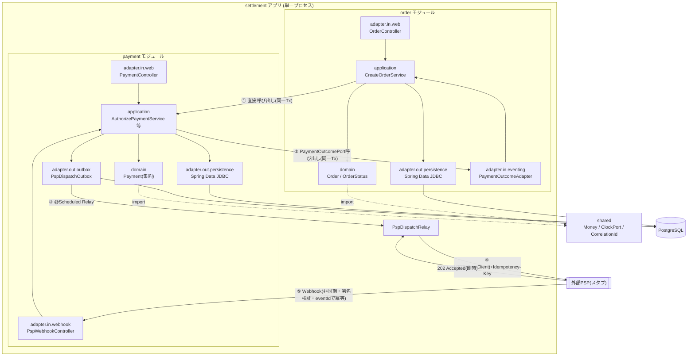
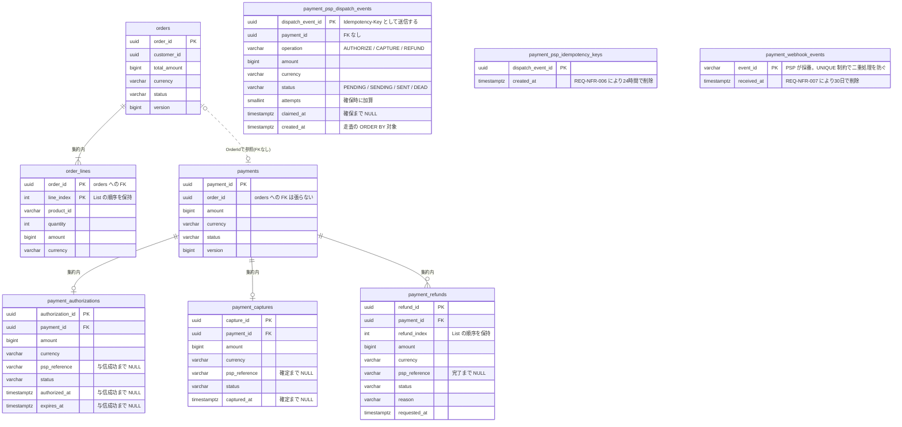
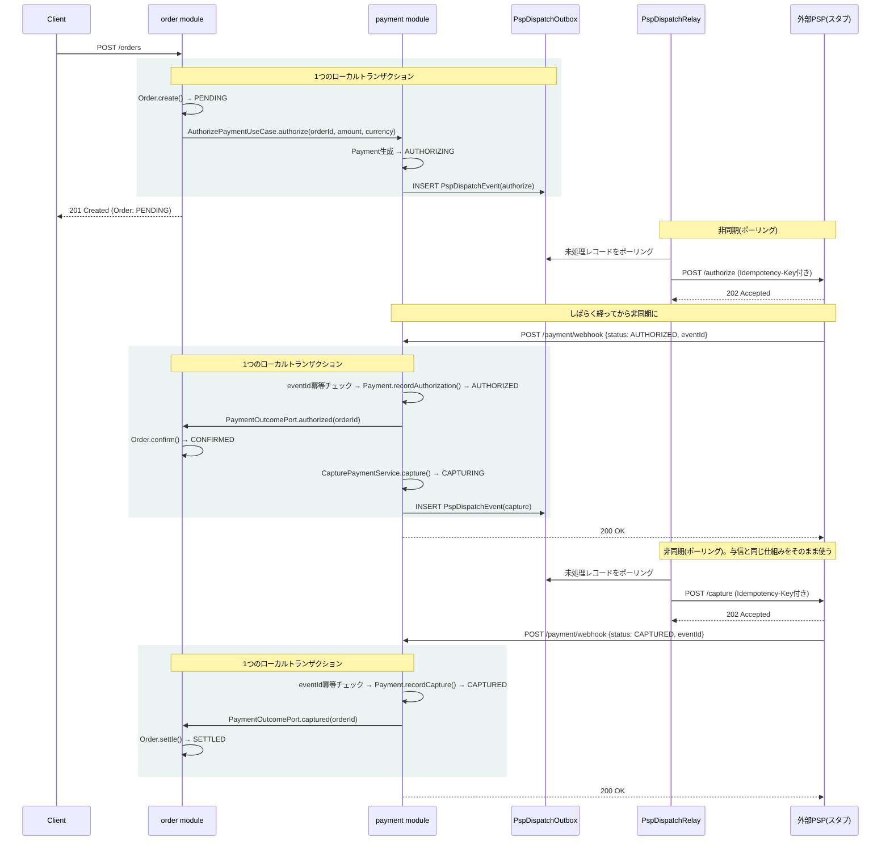
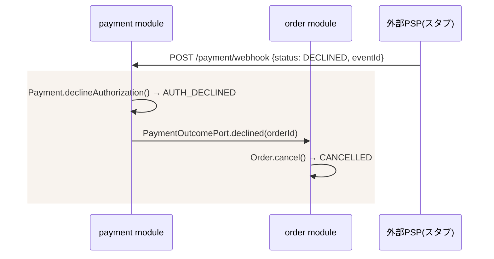
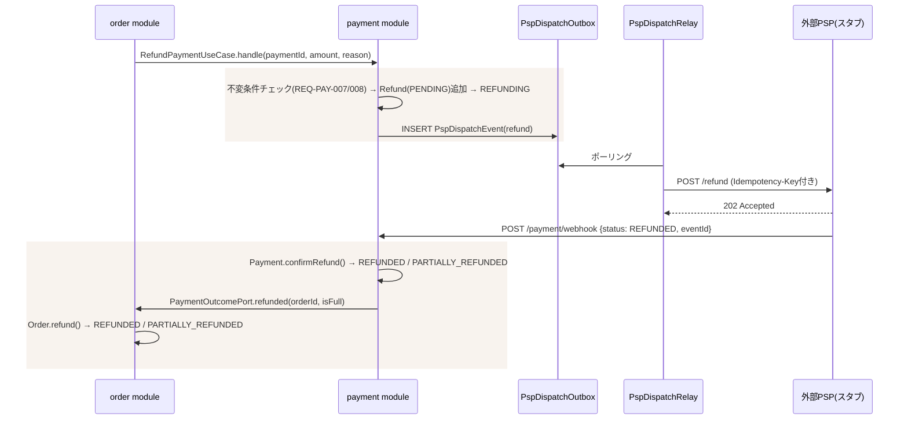

# 決済ドメインの実装設計

> 本書は**どう作るか**(アーキテクチャ・パッケージ構成・実装方式)を扱う。
> - なぜそうなのか(業務言語・業務ルール): [ubiquitous-language.md](./ubiquitous-language.md)
> - 何を満たすべきか(要件ID・状態遷移・非機能要件の具体値): [requirements.md](./requirements.md)
> - いつ作るか(実装の順序と完了条件): [plan.md](./plan.md)
>
> 業務ルールの変更は`ubiquitous-language.md`、要件の変更は`requirements.md`を先に更新し、本書を追随させること。

**技術前提**

- `com.example.settlement`（Maven artifactId: `settlement`）/ Java 21 / Spring Boot 4.1
- Spring Data JDBC + PostgreSQL + Flyway（JPAではない点に注意）
- Spring Web MVC、Validation、Actuator、Lombok
- Kafka 等の外部ブローカーは使わない（`compose.yaml` は `app` + `db` の2コンテナのみ）

---

## 1. 設計方針

- **モジュラーモノリス**: `order` / `payment` を境界づけられたコンテキストとしてトップレベルパッケージで分離し、各コンテキスト内を`domain` / `application` / `adapter`の3層にし、`adapter`をin/outで分ける。
- **自社ドメイン同士(Order⇔Payment)はローカルトランザクションで保証する**。Outboxは使わない。依存の向きは `order → payment` の一方向のみに固定する。
  - Order起点の呼び出し(与信・売上確定・返金の要求)は、`order`が`payment`のユースケース(port.in)を直接呼ぶ同期呼び出し。同一トランザクションに乗せられる。
  - Payment起点の通知(PSPからの結果が確定した後、Orderの状態を進める)は、`payment`が`order`を直接呼ばず、`payment.application.port.out`に自分で定義した`PaymentOutcomePort`インターフェース経由で行う。実装(`PaymentOutcomeAdapter`)は`order`側が用意し、DIで解決される。`payment`は「誰が実装しているか」を一切知らない。これにより`payment → order`の依存を作らず、循環依存を避ける。ただのメソッド呼び出しなので、呼び出し元のトランザクションにそのまま乗り、Payment更新とOrder更新は自然に1つのローカルトランザクションとして確定する。
- **本物の分散トランザクションはPayment⇔外部PSPのみ**。ここだけTransactional Outbox(以下「PSP Dispatch Outbox」)を使う。PaymentがPSPへ送るべきコマンドをローカルTxでOutboxテーブルにinsertし、`@Scheduled`のRelayが非同期にPSPへHTTPで送信する。
- **PSPからの応答はWebhookで非同期に受ける**(REQ-PSP-005〜008)。PSP呼び出し直後の同期レスポンスは受け付け確認(`202 Accepted`)のみとして扱い、最終結果は後から届くWebhookで確定させる。
- **Spring Data JDBCとの相性**: JDBCは「集約ルート以外にリポジトリを作らせない」設計になっているため、Payment集約の中にAuthorization/Capture/Refundを子エンティティとして持たせる構造(決済台帳に近い形)と相性が良い。



①②は自社ドメイン内なのでローカルトランザクション、③④⑤だけが本物の非同期・分散処理になる。この線引きが本設計の核。

---

## 2. パッケージ構成

```
com.example.settlement
├── order                        # 境界づけられたコンテキスト: 注文
│   ├── domain                   # Order, OrderId, CustomerId, OrderLine, ProductId, Quantity,
│   │                            # OrderStatus
│   │                            # ※Moneyはshared.Moneyをimportして使う(orderで再定義しない)
│   ├── application
│   │   ├── port.in              # CreateOrderUseCase, ConfirmOrderUseCase, CancelOrderUseCase,
│   │   │                        # SettleOrderUseCase, RefundOrderUseCase
│   │   ├── port.out             # OrderRepository(※集約ルート経由でのみ入出力)
│   │   └── service              # CreateOrderService（内部でpaymentのUseCaseを直接呼ぶ）
│   └── adapter
│       ├── in                   # orderを駆動する側
│       │   ├── web              # OrderController, DTO, GlobalExceptionHandler
│       │   └── eventing         # PaymentOutcomeAdapter implements PaymentOutcomePort
│       │                        # （paymentからの結果通知を受けてorderのUseCaseを呼ぶ）
│       └── out                  # orderが依頼する側
│           └── persistence      # 永続化専用モデル + マッパー + Spring Data JDBC Repository実装
│
├── payment                      # 境界づけられたコンテキスト: 決済
│   ├── domain                   # Payment(集約ルート), PaymentId, OrderId, PaymentStatus,
│   │                            # Authorization, AuthorizationId, AuthorizationStatus,
│   │                            # Capture, CaptureId, CaptureStatus,
│   │                            # Refund, RefundId, RefundStatus, RefundReason
│   │                            # ※OrderIdはpayment側で独自に定義する(order.domain.OrderIdとは別の型)。
│   │                            # 決済は注文を単なる参照としてしか扱わないため(UL §5)
│   │                            # ※Moneyはshared.Moneyをimportして使う
│   ├── application
│   │   ├── port.in              # AuthorizePaymentUseCase, RefundPaymentUseCase
│   │   │                        # ↑ orderから直接呼ばれる入口はこの2つのみ
│   │   ├── port.out             # PaymentOutcomePort（← orderモジュールが依存してよい唯一の公開interface）,
│   │   │                        # PaymentAuthorized/AuthDeclined/Captured/CaptureFailed/Refunded
│   │   │                        #   （PaymentOutcomePortの引数となるレコード）,
│   │   │                        # PspDispatchQueuePort, WebhookEventStorePort,
│   │   │                        # PaymentRepository(※集約ルート経由でのみ入出力)
│   │   └── service               # AuthorizePaymentService, RefundPaymentService, HandlePspWebhookService
│   │                             # CapturePaymentService(port.inを持たない内部専用サービス。
│   │                             #   HandlePspWebhookServiceが与信成功時に直接呼ぶ)
│   └── adapter
│       ├── in                     # paymentを駆動する側
│       │   ├── web                # PaymentController(照会用), GlobalExceptionHandler
│       │   └── webhook             # PspWebhookController(署名検証・eventId冪等チェック)
│       └── out                    # paymentが依頼する側
│           ├── persistence         # 永続化専用モデル(Payment集約丸ごと) + マッパー + Repository実装
│           ├── outbox               # PspDispatchEvent, PspDispatchQueuePortの実装, PspDispatchRelay(@Scheduled)
│           ├── gateway               # PspClient(RestClient)。PspDispatchRelayが送信に使う
│           └── idempotency            # WebhookEventJdbcStore(受信側の冪等性)
│
├── shared                          # Money, ClockPort, CorrelationId。orderとpaymentが共有するShared Kernel。
│                                    # 業務ロジックは持たず、通貨計算等の普遍的な不変条件のみを持つ。
│                                    # ArchUnitで「sharedはorder/paymentに依存しない」ことを検証する(§7)
│
├── pspsimulator                     # 演習用: 外部PSPを模したスタブ(実プロダクトなら別リポジトリ/別サービス)
│   ├── FakePspController             # /authorize /capture /refund → 即座に202 Acceptedを返す
│   └── WebhookDispatcher              # 別スレッド/遅延実行で settlement アプリへWebhookをPOSTする
│
└── SettlementApplication.java
```

**ポートの基準**: 外部に依頼する操作はすべて`application.port.out`にインターフェースとして定義し、実装を`adapter.out`(または他モジュール)に置く。集約のリポジトリも例外としない。`domain`はモデルのみを持ち、外部との接点を一切持たない。

**アダプタの基準**: DBもUIも等しく「外部」として扱い、駆動する側(`adapter.in`)と依頼される側(`adapter.out`)で分ける。`port.in`を呼ぶものが`adapter.in`、`port.out`を実装するものが`adapter.out`と対応する。`PaymentOutcomeAdapter`は`payment`の`port.out`を実装するが、`order`から見ると`order`のUseCaseを呼んで駆動する側なので`order.adapter.in`に置く。

**依存の向き**: `order → payment`（`payment.application.port.out`のみ）の一方向。`payment`パッケージは`order`を一切importしない。`PaymentOutcomePort`の実装(`PaymentOutcomeAdapter`)は`order`側が用意し、Spring DIが自動的に解決する。`shared`は例外的に`order`・`payment`の両方からimportされてよいが、`shared`自身は`order`・`payment`のどちらにも依存しない(依存は常に外側から`shared`への一方向)。`pspsimulator`は演習用の外部システム代役であり、`payment`とはHTTP経由でのみ繋がる。

---

## 3. ドメインモデルの実装方針

### Payment集約の構造

| 要素 | 種別 | 内容 |
|---|---|---|
| `Payment` | 集約ルート | PaymentId, OrderId, 金額, `PaymentStatus`, `Authorization`(0..1), `Capture`(0..1), `Refund`のリスト(0..n) |
| `Authorization` | エンティティ | authorizationId, amount, pspReference, `AuthorizationStatus`, authorizedAt, expiresAt |
| `Capture` | エンティティ | captureId, amount, pspReference, `CaptureStatus`, capturedAt |
| `Refund` | エンティティ | refundId, amount, pspReference, `RefundStatus`, reason, requestedAt |

各状態の値と遷移は[requirements.md §2](./requirements.md)で定義する。実装上の扱いは以下のとおり。

- `PaymentStatus`は子エンティティからの導出値ではなく、`payments`テーブルの列として永続化する。滞留中の決済(`*_ING`)を状態列だけで抽出できるようにするため。整合性は`Payment`集約が子エンティティの更新と同時に自ら維持する
- 状態はすべてJavaのenumとして定義し、遷移の可否はenum自身または集約のメソッドで判定する。文字列比較で分岐させない
- ドメインモデルにはフレームワークのアノテーションを付けない(§7)。`@Id`や`@MappedCollection`を伴う永続化専用モデルは`adapter.out.persistence`に別途置き、リポジトリ実装が集約との相互変換を担う
- 楽観ロックのため、集約ルートはアノテーションを持たない`long version`を保持する。`@Version`が付くのは永続化モデル側。Spring Data JDBCでは子エンティティのバージョンは扱えないため、`Payment`集約ルートにのみ持たせる
- リポジトリ実装は、読み込み時と保存後の双方でバージョンを集約へ書き戻す。Spring Data JDBCは`save()`が返すインスタンスにのみバージョンを加算し、またその値でINSERT/UPDATEを判定するため、書き戻しを怠ると既存集約の保存がINSERTとして発行される
- REQ-PAY-011の「直前の状態」は返金累計額から導出する(累計が0なら`CAPTURED`、0より大きければ`PARTIALLY_REFUNDED`)。直前の状態を保持する列は設けない。この累計は`RefundStatus.REFUNDED`の子のみを対象とする。REQ-PAY-008の超過判定では`PENDING`の返金も含める必要があるため、両者で集計対象が異なる

### 不変条件の置き場所

REQ-PAY-005〜008、REQ-PAY-010の各不変条件は、`Payment`集約のメソッド内で判定する(REQ-PAY-012)。application層のserviceにif文として書いてはならない。呼び出し側が検査を忘れても集約が自衛できる状態を保つため。

```java
// 良い例: 集約が自分で守る
payment.capture(amount);   // 内部で与信額・有効期限・PENDING重複を検査し、違反なら例外

// 悪い例: application層で検査する
if (amount.isGreaterThan(payment.authorizedAmount())) { throw ...; }
```

### コンテキスト間モデル

| コンテキスト | 集約ルート | 主な値オブジェクト | ドメインイベント |
|---|---|---|---|
| Order | Order | OrderId / CustomerId / OrderLine / ProductId / Quantity / Money | OrderCreated / OrderConfirmed / OrderCancelled / OrderSettled / OrderRefunded |
| Payment | Payment | PaymentId / Money | PaymentAuthorized / PaymentAuthDeclined / PaymentCaptured / PaymentCaptureFailed / PaymentRefunded / PaymentPartiallyRefunded |

### 永続化



`payment_psp_dispatch_events`には`(created_at)`の部分索引を`WHERE status IN ('PENDING','SENDING')`で張る。`SENT`は削除されず蓄積するため、走査対象を処理待ちの行だけに限定する。

**外部キーは集約の内側にのみ張る。** `payments`が`orders`を参照する箇所と、Outbox・冪等性の3テーブルには張らない。前者は境界づけられたコンテキストをまたぐため、後者は業務データとは独立した仕組みであるため。将来サービスとして分割する際、外部キーがあるとテーブルを別DBへ移せなくなる。

`payment_psp_dispatch_events`・`payment_psp_idempotency_keys`・`payment_webhook_events`は集約ではない。`Payment`集約の永続化とは別のアダプタが読み書きする。

カラム定義・制約・インデックスはマイグレーションファイル自体を仕様とする(二重管理を避ける)。上図に載せているのは主キーと関連のみ。`order`側にはOutboxテーブルを持たない。

---

## 4. 処理フローとコンポーネント間の呼び出し

各操作は「業務データの更新とディスパッチレコードのinsertを同一トランザクションで行う」→「Relayが非同期に送信」→「Webhookで結果を受けて状態を確定させ、同一トランザクション内で`PaymentOutcomePort`を呼ぶ」という同一のサイクルを辿る。与信・売上確定・返金でこの構造は変わらない。

売上確定は`order`から呼ばれる入口(port.in)を持たず、`HandlePspWebhookService`が与信成功を確定させるのと同一トランザクション内で`CapturePaymentService`を直接呼ぶ(REQ-PAY-004)。

### 正常系(与信 → 売上確定)



クライアントは`POST /orders`の時点でOrderの最終確定を待たず、`PENDING`のまま応答を受け取る。確定はWebhook到達後に反映される。

### 与信拒否



売上確定失敗も同じ形で、`PaymentOutcomePort.captureFailed()` → `Order`を`SETTLEMENT_FAILED`へ遷移させる。

### 返金



---

## 5. 外部PSP境界の実装方針

- `PspDispatchQueuePort`（application/port.out）に「PSPへ送るべきコマンドをキューに積む」操作を定義。実際の送信は`adapter.out.outbox.PspDispatchRelay`(`@Scheduled`)が担い、`adapter.out.gateway.PspClient`(RestClient)でHTTP呼び出しする。
- **ディスパッチの走査と送信**: 詳細は§5.1。
- **送信失敗時**: 指数バックオフで再送し、上限(REQ-NFR-002)を超えたレコードは`DEAD`として送信を止める。
- **送信側の冪等性**: `Idempotency-Key`にはディスパッチレコードのIDをそのまま用い、リトライ時も同じ値を送る。`payment_psp_idempotency_keys`で管理する。
- **署名検証**: Webhookの共有シークレットによるHMAC署名ヘッダーを`PspWebhookController`で検証する。
- **受信側の冪等性**: Webhookペイロードの`eventId`を`payment_webhook_events`に記録し、UNIQUE制約で二重処理を防ぐ。
- **適用できないWebhook**: 現在の状態に適用できない通知を受けた場合も、状態を変えずに`200 OK`を返す(REQ-PSP-007)。エラーを返すとPSPが再送を繰り返すため。
- **素早くACKする**: `PspWebhookController`は署名検証・冪等チェック・状態更新までを1トランザクションで完結させ、重い処理を後回しにしない。
- **`pspsimulator`**: 全エンドポイントで`202 Accepted`のみを返し、結果は`WebhookDispatcher`が遅延送信する。可否判定は金額に基づくルールで行う(REQ-SIM-003/004)。ランダムにするとE2Eテストが不安定になるため。

### 5.1 ディスパッチの走査・送信・回収

#### ディスパッチレコードの状態

| 状態 | 意味 |
|---|---|
| `PENDING` | 未送信。走査の対象 |
| `SENDING` | Relayが確保済み。送信中 |
| `SENT` | PSPが`202 Accepted`で受理した。**決済の成否ではない**(結果はWebhookで別途確定する) |
| `DEAD` | 試行回数が上限(REQ-NFR-002)に達した。以降は拾わず、人手で調査する |

```
PENDING ──確保──→ SENDING ──202受理──→ SENT
   ↑                  │
   └──回収(§後述)──────┘
   
   attempts が上限に達したら → DEAD
```

#### 走査(確保)

`SELECT ... FOR UPDATE SKIP LOCKED`で未送信レコードを確保する。`FOR UPDATE`だけでは他インスタンスが待たされて直列化してしまうため、`SKIP LOCKED`でロック済みの行を待たずに読み飛ばし、各インスタンスが重複しない集合を並行して処理できるようにする。

```sql
SELECT * FROM payment_psp_dispatch_events
 WHERE status = 'PENDING'
    OR (status = 'SENDING' AND claimed_at < now() - interval '1 minute')  -- 回収対象
 ORDER BY created_at
 LIMIT 10
 FOR UPDATE SKIP LOCKED;
```

#### 確保と送信を分ける

HTTP呼び出しをトランザクション内で行うと、応答待ちの数秒間ずっと行ロックとDBコネクションを占有してしまう。そのため確保と送信を別トランザクションに分割する。

```
BEGIN;
  SELECT ... FOR UPDATE SKIP LOCKED     -- 担当分を確保
  UPDATE SET status='SENDING', claimed_at=now(), attempts=attempts+1
COMMIT;                                  -- ロック解放

  → PSPへHTTP送信(トランザクション外)

BEGIN;
  UPDATE SET status='SENT'  もしくは 失敗情報を記録
COMMIT;
```

**`attempts`は送信失敗時ではなく確保時に加算する**。送信前にプロセスが落ちた場合でもカウントが進むため、毎回クラッシュを引き起こすレコードが無限に再試行され続けることを防げる。

#### 取り残された行の回収

`SENDING`にした直後、HTTP送信の前にプロセスが落ちる(OOM・kill・デプロイによる再起動)と、その行は`PENDING`ではないため通常の走査対象から外れ、**永久に処理されないまま放置される**。例外もログも出ないため誰も気づかない。

これを防ぐため、`claimed_at`から一定時間(1分)を過ぎても`SENDING`のままの行を、送信されなかったものとみなして再度走査対象に含める(上記クエリのOR条件)。回収専用のスケジューラは設けない。ただし回収の発生は異常の兆候であるため、WARNログに記録する。

タイムアウトは正常な送信にかかる最大時間より十分長く取る。読み取りタイムアウトが5秒(REQ-NFR-003)であるのに対し1分を設定しており、処理中の行を誤って横取りする余地はほぼ無い。

**再送が安全である根拠**: プロセスが落ちた位置は「送信前」か「送信後・結果記録前」のいずれかである。前者なら再送が初回送信となり正しい。後者ならPSPには2回目の到達となるが、`Idempotency-Key`が同一であるためPSP側が重複と判定して処理しない(REQ-PSP-003 / REQ-SIM-005)。**つまりこの回収処理は冪等性キーの存在を前提として初めて成立する**。冪等性キーが無ければ二重決済になる。

### 設定値

具体的な数値は[requirements.md §4](./requirements.md)で定義する。実装ではハードコードせず`application.properties`から注入し、テスト時に短縮できるようにする。

```properties
settlement.psp.dispatch.polling-interval=1s
settlement.psp.dispatch.max-attempts=5
settlement.psp.dispatch.claim-timeout=1m
settlement.psp.connect-timeout=3s
settlement.psp.read-timeout=5s
settlement.psp.authorization-validity=7d
settlement.psp.idempotency-key-retention=24h
settlement.psp.webhook-event-retention=30d
```

---

## 6. 実装上の要点

- **Outboxのスコープを絞る**: Outboxは`payment`モジュール内の「PSPへ送るべきコマンド」専用。Order⇔Payment間には作らない。
- **モジュール間の疎結合はカスタムport(Dependency Inversion)で実現する**: `PaymentOutcomePort`を`payment`自身が定義し、実装は`order`側が提供してDIで解決される。Springのイベント機構を使わないため、フェーズ(コミット前/後)を意識せずとも呼び出し元のトランザクションにそのまま乗る。既存のport.in/port.outパターンと一貫しており、モックによる単体テストも容易。
- **冪等性は送信側・受信側の両方に必要**: 送信は`Idempotency-Key`、受信は`eventId`。片方だけでは不十分。
- **不変条件はPayment集約に閉じ込める**(§3)。
- **状態遷移を明示する**: 各操作は必ず`PENDING`系を経由してから最終状態に落ち着く状態機械として実装し、許可されない遷移は実行時に弾く。
- **テスト戦略**: domain層(Payment集約の不変条件)は純粋なユニットテストで手厚く。`payment`⇔PSP間はWireMock等でHTTPスタブ化し、202応答・遅延Webhook・重複Webhook・署名検証エラーのケースを検証する。
- **テストに要件IDを書く**: 各テストの`@DisplayName`に対応する要件ID(`REQ-PAY-005`等)を含める。要件とテストの対応が追跡でき、テストの無い要件を未実装として検出できる([requirements.md §1](./requirements.md))。

---

## 7. 依存関係の自動検証

§1・§2で定めた依存の向きは、レビューだけに頼らず**ArchUnit**で機械的に検証する。`import`が1行紛れ込むだけで境界が壊れるため。

### 追加する依存関係(pom.xml)

```xml
<dependency>
    <groupId>com.tngtech.archunit</groupId>
    <artifactId>archunit</artifactId>
    <version>${archunit.version}</version>
    <scope>test</scope>
</dependency>
```

### 検証するルール

```java
class ArchitectureTest {

    private static final JavaClasses classes = new ClassFileImporter()
        .withImportOption(ImportOption.Predefined.DO_NOT_INCLUDE_TESTS)
        .importPackages("com.example.settlement");

    @Test
    void paymentMustNotDependOnOrder() {
        noClasses().that().resideInAPackage("..payment..")
            .should().dependOnClassesThat().resideInAPackage("..order..")
            .check(classes);
    }

    @Test
    void sharedMustNotDependOnOrderOrPayment() {
        noClasses().that().resideInAPackage("..shared..")
            .should().dependOnClassesThat().resideInAnyPackage("..order..", "..payment..")
            .check(classes);
    }

    @Test
    void domainMustNotDependOnOuterLayers() {
        noClasses().that().resideInAPackage("..domain..")
            .should().dependOnClassesThat().resideInAnyPackage("..application..", "..adapter..")
            .check(classes);
    }

    @Test
    void onlyOrderMayImplementPaymentOutcomePort() {
        classes().that().implement("com.example.settlement.payment.application.port.out.PaymentOutcomePort")
            .should().resideInAPackage("..order..")
            .check(classes);
    }

    @Test
    void domainMustNotDependOnFrameworks() {
        noClasses().that().resideInAnyPackage("..domain..", "..shared..")
            .should().dependOnClassesThat().resideInAnyPackage(
                "org.springframework..", "jakarta.persistence..", "jakarta.validation..")
            .check(classes);
    }
}
```

`mvn test`の一部として毎回実行され、以下を保証する。

- `payment`が`order`を一切importしない
- `shared`が`order`/`payment`のどちらにも依存しない(Shared Kernelとしての`Money`が業務ロジックを持ち込む方向に育たないための歯止め)
- 各コンテキストの`domain`層が外側の層に依存しない
- `PaymentOutcomePort`の実装が`order`パッケージ以外に増えない
- `domain`層と`shared`がフレームワークに依存しない(永続化アノテーションをドメインモデルに付けない)

### 方式の選定: ArchUnitのみを採用する

依存関係の検証はArchUnitのみで行い、Mavenのマルチモジュール分割は**採用しない**。

Mavenモジュール分割には「依存を`pom.xml`に宣言しないことで、相手のクラスがコンパイル時のクラスパスから物理的に消える」という強みがある。違反はテストを待たずビルド時点で失敗し、IDE上でも入力した瞬間にエラーになる。しかし表現できるのは「モジュール間の依存可否」という粒度に限られ、上記5ルールのうち前半2つしか肩代わりできない。

| ルール | Maven分割 | ArchUnit |
|---|---|---|
| `payment` → `order` の禁止 | 可 | 可 |
| `shared` → `order`/`payment` の禁止 | 可 | 可 |
| `domain`層 → 外側の層 の禁止 | **不可**(1モジュール内のパッケージ関係のため) | 可 |
| `PaymentOutcomePort`の実装者の限定 | **不可**(依存宣言では表現できない) | 可 |
| `domain`層 → フレームワーク の禁止 | **不可**(全モジュールがSpringに依存するため) | 可 |

分割してもArchUnitは引き続き必要であり、その代償として`pom.xml`の増加・ビルド順序の管理・モジュールをまたぐリファクタリングのコストを負うことになる。割に合わないため、単一モジュールを維持する。

**この方式の限界**: ArchUnitはコンパイルを妨げないため、テストが実行されなければ違反はそのまま通過する。本演習ではCIの構築をスコープ外とするため、検出はローカルでの`mvn test`の実行に依存する。開発中は繰り返しテストを走らせるため実質的には機能するが、「テストを流さなければ違反したままコミットできる」状態であることは意識しておく。チーム開発へ移行する際は、CIで`mvn test`を必須にすることが最初の一歩になる。

Mavenモジュール分割が意味を持つのは、`order`と`payment`を実際に別サービスとしてデプロイする段階である。そのときは分割自体が目的となるため、副次的にコンパイル時の強制も得られる。
